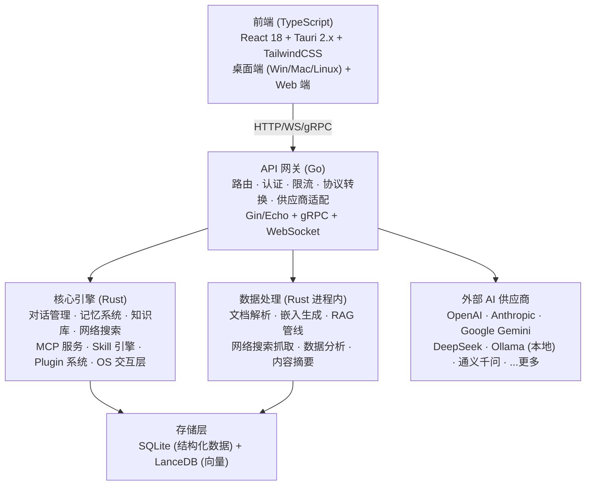
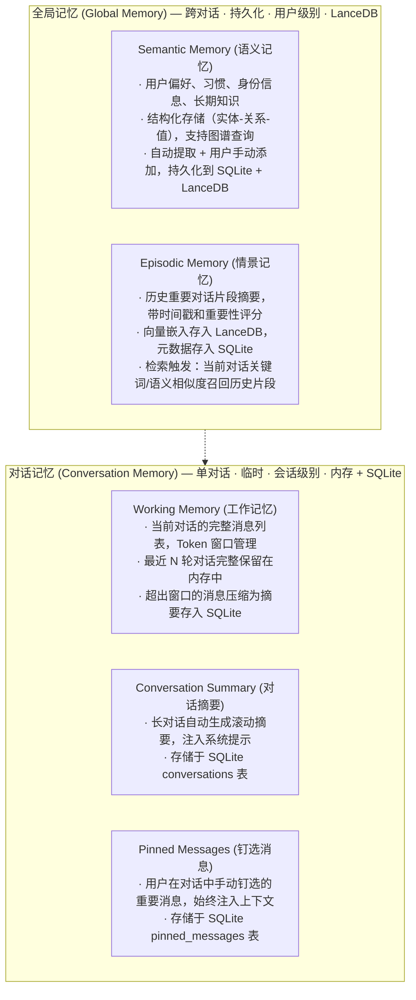
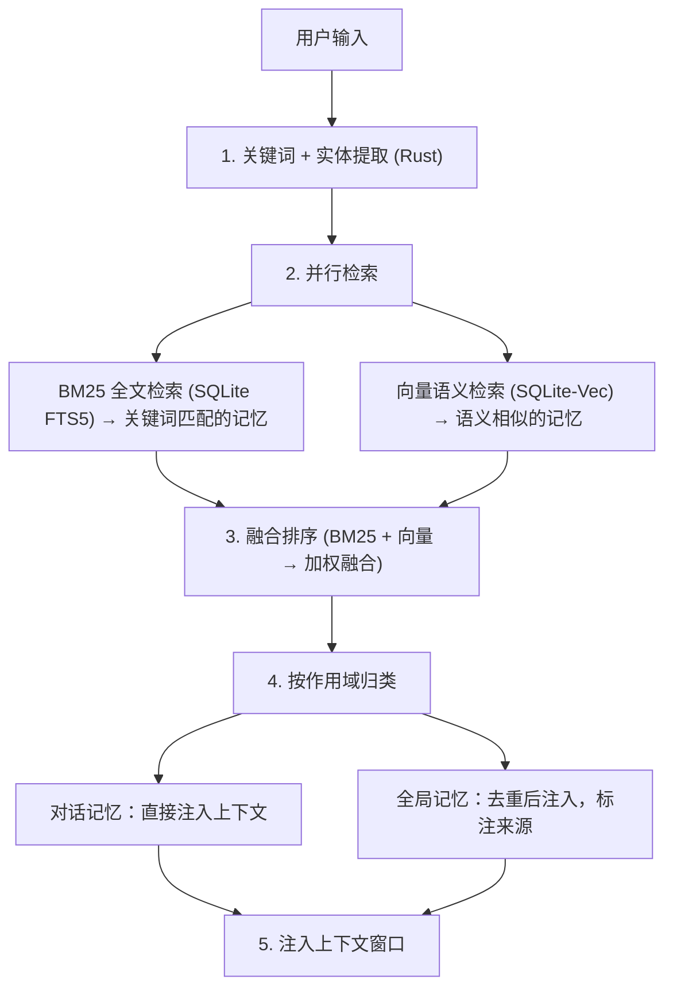
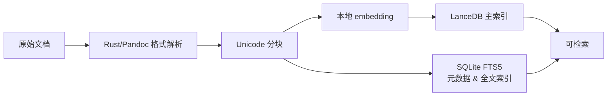
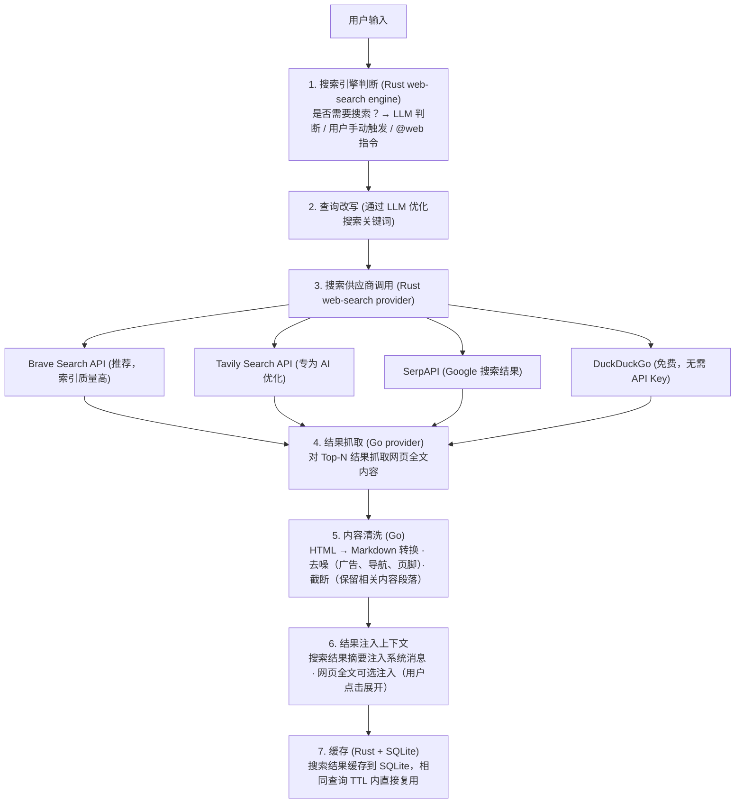
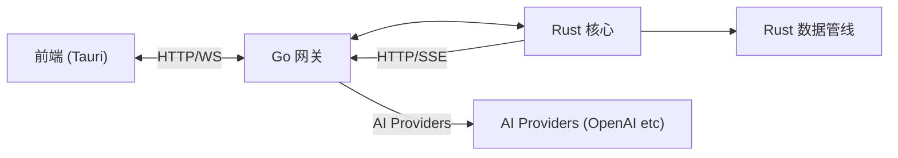

# EncoreHub 开发计划书

---

## 一、项目概述

### 1.1 项目名称
**EncoreHub** —— 跨平台 AI 聊天客户端

### 1.2 项目定位
面向开发者和高级用户的全功能 AI 交互平台。聚合多家 AI 服务商，提供统一、简约的聊天体验，同时支持知识库、MCP 协议、记忆系统、技能系统、插件生态等可扩展能力。

### 1.3 核心价值主张
- **一处聚合**：一个客户端对接所有主流 AI 供应商，无需切换工具
- **简约不简单**：前端极简设计，后端能力深厚
- **可编程**：通过 Skill / Plugin / MCP 构建个性化 AI 工作流
- **跨平台**：Windows、macOS、Linux 桌面端 + Web 端
- **本地优先**：数据本地存储，隐私可控

---

## 二、技术架构总览



### 2.1 技术选型理由

| 层次 | 技术 | 选型理由 |
|------|------|----------|
| **API 网关** | Go | 高并发、低延迟、协程模型天然适合 IO 密集型网关；静态编译部署简单 |
| **核心引擎** | Rust | 零成本抽象、内存安全、高性能；适合记忆系统/知识库/插件宿主等性能敏感模块 |
| **数据处理** | Rust | 与 Engine、附件生命周期和本地存储同进程；避免额外运行时与跨进程复制，Pandoc 作为可选高保真转换器 |
| **前端** | React + Tauri | Tauri 使用 Rust 内核，与后端 Rust 生态一致；包体积极小（~5MB vs Electron ~100MB） |

### 2.2 跨平台策略

| 平台 | 方案 | 优先级 |
|------|------|--------|
| **Windows** | Tauri 原生 + MSI 安装包 | P0 |
| **macOS** | Tauri 原生 + DMG 安装包 (Apple Silicon + Intel) | P0 |
| **Linux** | Tauri 原生 + AppImage/deb/rpm | P0 |
| **Web** | WASM 编译前端 + PWA | P1 |
| **iOS / Android** | Tauri Mobile (未来考虑) | P2 |

---

## 三、模块详细设计

### 3.1 前端模块 (React + TypeScript + Tauri)

```
frontend/
├── src/
│   ├── components/
│   │   ├── chat/              # 聊天核心组件
│   │   │   ├── ChatView       # 聊天主视图
│   │   │   ├── MessageBubble  # 消息气泡（支持 Markdown/代码高亮/图片）
│   │   │   ├── InputBox       # 输入框（支持多行/附件/语音）
│   │   │   ├── StreamingText  # 流式文本渲染
│   │   │   └── ContextPanel   # 上下文面板（记忆/知识库引用）
│   │   ├── sidebar/           # 侧边栏
│   │   │   ├── ConversationList  # 对话列表
│   │   │   ├── ProviderSwitcher  # 供应商/模型切换
│   │   │   └── SearchBar        # 全局搜索
│   │   ├── settings/          # 设置面板
│   │   │   ├── ProviderConfig   # 供应商 API 配置
│   │   │   ├── ModelConfig      # 模型参数配置
│   │   │   ├── SkillManager     # Skill 管理
│   │   │   └── PluginManager    # Plugin 管理
│   │   └── knowledge/         # 知识库界面
│   │       ├── DocumentUpload   # 文档上传
│   │       ├── KnowledgeGraph   # 知识图谱可视化
│   │       └── ChunkViewer      # 文档块查看
│   ├── hooks/                 # 自定义 Hooks
│   ├── stores/                # 状态管理 (Zustand)
│   ├── services/              # API 调用层
│   └── utils/                 # 工具函数
├── src-tauri/                 # Tauri Rust 层
│   ├── src/
│   │   ├── main.rs            # 窗口管理/系统托盘/全局快捷键
│   │   ├── commands/          # Tauri Commands (IPC)
│   │   └── os-integration/   # OS 集成（文件系统/通知/剪贴板）
│   └── tauri.conf.json
└── package.json
```

**设计原则**：
- 极简美学：大量留白、克制配色、无冗余 UI 元素
- 键盘优先：所有操作可通过快捷键完成
- 响应式：自适应窗口尺寸，支持窄屏侧边栏折叠
- 暗色/亮色主题自动切换

**关键交互**：
- 流式输出打字机效果
- 消息编辑/重新生成/分支对话
- 拖拽上传文件到知识库
- 右键菜单快速操作
- Command Palette（Ctrl+K）全局命令面板

---

### 3.2 API 网关 (Go)

```
gateway/
├── cmd/
│   └── gateway/
│       └── main.go
├── internal/
│   ├── router/               # 路由层
│   │   ├── middleware/       # 中间件（认证/限流/日志/CORS）
│   │   └── handler/          # 请求处理器
│   ├── provider/             # AI 供应商适配器
│   │   ├── adapter.go        # 统一接口定义
│   │   ├── openai/           # OpenAI / 兼容 OpenAI 格式
│   │   ├── anthropic/        # Anthropic Claude
│   │   ├── google/           # Google Gemini
│   │   ├── deepseek/         # DeepSeek
│   │   ├── ollama/           # Ollama 本地模型
│   │   └── custom/           # 自定义供应商模板
│   ├── protocol/             # 协议转换
│   │   ├── unified_request   # 统一请求格式
│   │   ├── unified_response  # 统一响应格式
│   │   └── stream/           # SSE 流式处理
│   ├── auth/                 # API Key 管理
│   ├── ratelimit/            # 速率限制
│   ├── loadbalancer/         # 负载均衡（多 Key 轮转）
│   └── observability/        # 可观测性（Metrics/Tracing/Logging）
├── pkg/
│   └── sdk/                  # 对外 SDK
└── go.mod
```

**统一请求/响应格式**：

```json
// 请求
{
  "provider": "openai",
  "model": "gpt-4o",
  "messages": [],
  "stream": true,
  "tools": [],
  "context": {
    "memories": [],
    "knowledge": []
  }
}
```

```
// 响应 (SSE)
event: delta
data: {"content": "Hello", "tool_calls": null}

event: done
data: {"usage": {"input": 150, "output": 80}, "finish_reason": "stop"}
```

**核心能力**：
- 多供应商协议统一转换（将内部统一格式转为各供应商原生格式）
- 流式响应代理（SSE → SSE 透传 + 格式标准化）
- 多 Key 轮转负载均衡 + 自动故障转移
- 请求/响应拦截管道（日志、审计、内容过滤）
- WebSocket 支持（用于实时协作场景）

---

### 3.3 核心引擎 (Rust)

```
engine/
├── crates/
│   ├── core/                 # 核心抽象
│   │   ├── types/            # 统一数据类型
│   │   └── error/            # 错误类型
│   ├── conversation/         # 对话管理
│   │   ├── manager           # 对话 CRUD/分支/合并
│   │   ├── context           # 上下文窗口管理
│   │   ├── compressor        # 上下文压缩/摘要
│   │   └── storage           # 持久化存储 (SQLite + 索引)
│   ├── memory/               # 记忆系统 ⭐
│   │   ├── working/          # 工作记忆（当前会话）
│   │   ├── episodic/         # 情景记忆（过往对话片段）
│   │   ├── semantic/         # 语义记忆（长期知识）
│   │   ├── retrieval/        # 检索策略（向量+关键词混合）
│   │   └── consolidation/    # 记忆巩固（定期汇总）
│   ├── knowledge/            # 知识库 ⭐
│   │   ├── ingestion/        # 文档摄入管道
│   │   ├── chunking/         # 智能分块策略
│   │   ├── indexing/         # 向量索引 (usearch/lance)
│   │   ├── retrieval/        # 混合检索 (BM25 + 向量)
│   │   └── graph/            # 知识图谱 (实体关系)
│   ├── mcp/                  # MCP 协议实现 ⭐
│   │   ├── server/           # MCP Server（暴露能力）
│   │   ├── client/           # MCP Client（调用外部 MCP）
│   │   ├── registry/         # MCP 服务器注册表
│   │   └── transport/        # 传输层 (stdio/SSE/WebSocket)
│   ├── skill/                # Skill 系统 ⭐
│   │   ├── engine            # Skill 执行引擎
│   │   ├── loader/           # Skill 加载器（文件/目录）
│   │   ├── sandbox/          # 安全沙箱
│   │   └── registry/         # Skill 注册中心
│   ├── plugin/               # Plugin 系统 ⭐
│   │   ├── host/             # WASM 宿主运行时
│   │   ├── sdk/              # Plugin 开发 SDK
│   │   ├── manifest/         # Plugin 清单解析
│   │   └── marketplace/      # 插件市场客户端
│   ├── os-abstraction/       # OS 抽象层 ⭐
│   │   ├── filesystem/       # 文件系统操作
│   │   ├── process/          # 进程管理
│   │   ├── clipboard/        # 剪贴板
│   │   ├── notification/     # 系统通知
│   │   ├── shell/            # Shell 执行
│   │   └── screen/           # 屏幕截图/录屏
│   ├── web-search/           # 网络搜索 ⭐
│   │   ├── engine            # 搜索引擎调度
│   │   ├── provider/         # 搜索供应商适配
│   │   │   ├── brave.rs      # Brave Search API
│   │   │   ├── tavily.rs     # Tavily Search API
│   │   │   ├── serpapi.rs    # SerpAPI
│   │   │   └── duckduckgo.rs # DuckDuckGo (免费)
│   │   ├── scraper/          # 网页抓取（获取搜索结果的页面全文）
│   │   └── cache/            # 搜索结果缓存
│   └── storage/              # 存储层
│       ├── sqlite/           # SQLite (对话/配置/元数据/全文索引)
│       ├── lancedb/          # LanceDB 向量存储 (记忆/知识库嵌入)
│       └── blob/             # 文件存储
├── src/
│   └── main.rs               # 服务入口
└── Cargo.toml
```

#### 3.3.1 记忆系统设计

记忆分为两大作用域：**对话记忆**（Conversation Memory，绑定到单次对话）和 **全局记忆**（Global Memory，跨对话共享）。



**存储映射**：

| 记忆类型 | 结构化数据 | 向量嵌入 | 生命周期 |
|----------|-----------|----------|----------|
| Working Memory | 内存 | — | 单次会话 |
| Conversation Summary | SQLite | — | 对话存续 |
| Pinned Messages | SQLite | — | 手动管理 |
| Episodic Memory | SQLite (meta) | SQLite-Vec | 永久 |
| Semantic Memory | SQLite (meta+graph) | LanceDB | 永久 |

**记忆检索流程**：


**记忆巩固 (Memory Consolidation)**：
- 后台定时任务，每 N 轮对话或会话结束后触发
- 从 Working Memory 中提取关键信息：
  - 用户偏好变更 → 更新 Semantic Memory
  - 重要对话片段 → 生成摘要存入 Episodic Memory
  - 冗余/矛盾记忆 → 合并或标记过期
- 通过 Gateway 调用用户选定模型做抽取和摘要；本地持久化仍由 Rust 负责

#### 3.3.2 知识库设计



支持格式：PDF / Word / Markdown / 纯文本 / 代码文件 / 网页
检索策略：SQLite FTS5 BM25 关键词 + LanceDB 向量语义 → 加权融合 → Reranker 精排

#### 3.3.3 MCP (Model Context Protocol) 设计

- **MCP Server 端**：将 EncoreHub 自身能力（文件操作、知识库搜索、Shell 执行等）暴露为 MCP 工具，供外部 AI 客户端调用
- **MCP Client 端**：连接第三方 MCP 服务器，扩展 AI 能力边界
- **传输层**：stdio（本地进程）、SSE（HTTP 流）、WebSocket（双向实时）

#### 3.3.4 Skill 系统设计

借鉴 Claude Code 的 Skill 模型：
- 每个 Skill 是一个目录，包含 `SKILL.md` 描述文件和可选的脚本/资源
- Skill 引擎解析 SKILL.md 中的触发条件和执行逻辑
- 支持内置 Skill 和用户自定义 Skill
- Skill 可调用 Plugin、MCP 工具、OS 能力

#### 3.3.5 Plugin 系统设计

- **运行时**：WASM (WebAssembly) 沙箱，安全隔离
- **接口**：定义标准 WIT (WASI 接口类型)，覆盖聊天钩子、工具注册、UI 扩展
- **分发**：Plugin 市场，Git 仓库直接安装
- **生命周期**：安装 → 配置 → 启用/禁用 → 卸载

#### 3.3.6 网络搜索模块

AI 模型的知识有截止日期，网络搜索让 EncoreHub 能获取实时信息。Gateway 负责供应商调用与内容清洗，Rust Engine 负责配置、缓存和上下文数据。



**搜索供应商配置（在 Go 网关层管理 API Key）**：

| 供应商 | API Key 需求 | 特点 | 默认配额 |
|--------|-------------|------|----------|
| Brave Search | 免费额度 2000/月 | 独立索引，质量好 | P0 内置 |
| DuckDuckGo | 无需 Key | 完全免费，速率限制 | P0 内置 |
| Tavily | 需注册 | 专为 AI Agent 设计 | P1 可选 |
| SerpAPI | 付费 | Google 结果，最准确 | P1 可选 |
| SearXNG | 自部署 | 元搜索引擎，隐私优先 | P1 可选 |

**搜索结果缓存策略**：
- 缓存 Key：`query + provider` 的哈希
- TTL：默认 1 小时，可配置
- 存储：SQLite `search_cache` 表
- 用户可手动清除缓存或强制刷新搜索

---

### 3.4 Rust 原生数据管线

```
engine/
├── src/document_processing.rs       # DOCX/ODT/EPUB/HTML/RTF + Unicode 分块
├── src/api/attachments.rs           # Pandoc 优先、Rust 回退、OCR 编排
├── src/api/knowledge.rs             # 摄入、检索与回退策略
└── crates/storage/src/
    ├── lancedb/                     # Knowledge 主向量库
    └── sqlite/vectors.rs            # Knowledge 回退 + 单轮 Memory
```

**职责边界**：
- 数据管线在 Rust Engine 内运行，不引入额外服务或语言运行时
- SQLite 是文档、chunk 与 Memory 元数据的权威存储
- LanceDB 是 Knowledge 主向量库，SQLite-Vec 是 Knowledge 回退与单轮 Memory 库
- 384 维 feature-hash embedding 保证完全离线；仅在召回基准证明必要时引入语义模型
- 详细契约见 `docs/RUST_DATA_PIPELINE.md` 与 ADR-0007

---

## 四、数据流与通信协议

### 4.1 服务间通信



### 4.2 核心数据模型

```protobuf
// 对话
message Conversation {
  string id;
  string title;
  repeated Message messages;
  ContextSnapshot context;
  Metadata metadata;
}

// 消息
message Message {
  string id;
  Role role;  // user | assistant | system | tool
  repeated ContentBlock content;  // 支持多模态
  repeated ToolCall tool_calls;
  string parent_id;  // 支持分支对话
}

// 记忆
message Memory {
  string id;
  MemoryScope scope;  // conversation | global
  MemoryType type;    // working | episodic | semantic | pinned
  string conversation_id;  // 对话记忆绑定的对话（全局记忆为空）
  string content;
  float importance;  // 0.0 - 1.0
  vector<float> embedding;  // 存入 LanceDB
  Timestamp created_at;
  Timestamp last_accessed;
}

// 搜索结果
message SearchResult {
  string id;
  string query;
  string provider;  // brave | tavily | serpapi | duckduckgo
  string title;
  string url;
  string snippet;
  string full_content;  // 抓取后的清洗文本
  float relevance_score;
  Timestamp cached_at;
  Timestamp expires_at;
}

// Skill 定义
message SkillDefinition {
  string name;
  string description;
  string trigger;  // 触发条件
  repeated Tool tools;  // 暴露的工具
  string entrypoint;
}
```

---

## 五、开发路线图

### Phase 1: 核心骨架 (0-3 个月) 🎯 MVP

| 模块 | 任务 | 产出 |
|------|------|------|
| **Go 网关** | 基础路由、OpenAI/Anthropic 适配器、SSE 流式代理 | 可对话的最简网关 |
| **Rust 核心** | 对话管理 + SQLite 存储 + 基础 OS 抽象 | 对话持久化 |
| **前端** | Tauri 壳 + 聊天界面 + 流式渲染 + 侧边栏 | 可用的聊天窗口 |
| **集成** | 前端 ↔ Go ↔ Rust 联通，单供应商对话闭环 | **MVP 可演示** |

### Phase 2: 多供应商 + 记忆 + 知识库 + 网络搜索 (3-6 个月)

| 模块 | 任务 | 产出 |
|------|------|------|
| **Go 网关** | 新增 6+ 供应商适配器、多 Key 负载均衡、限流 | 全供应商覆盖 |
| **Rust 核心** | 记忆系统（对话记忆+全局记忆，SQLite + LanceDB）、知识库（摄入+检索）、**网络搜索模块** | 上下文增强 + 实时信息 |
| **Rust 数据管线** | 文档解析、嵌入生成、LanceDB/SQLite-Vec 回退 | 本地知识库 + Memory 检索 |
| **前端** | 多模型切换 UI、知识库管理界面、上下文面板、**搜索触发按钮/指令** | 完整用户体验 |

### Phase 3: MCP + Skill + Plugin (6-9 个月)

| 模块 | 任务 | 产出 |
|------|------|------|
| **Rust 核心** | MCP Server/Client、Skill 引擎、Plugin WASM 宿主 | 可扩展平台 |
| **前端** | Skill 管理器、Plugin 市场界面、MCP 配置 | 扩展管理 UI |
| **生态** | 首批内置 Skill、Plugin SDK 文档、开发者指南 | 开发者就绪 |

### Phase 4: 打磨 + 跨平台 + 发布 (9-12 个月)

| 模块 | 任务 | 产出 |
|------|------|------|
| **跨平台** | Windows/macOS/Linux 打包、自动更新、Web PWA | 全平台覆盖 |
| **性能** | 冷启动优化、内存优化、向量检索性能调优 | 流畅体验 |
| **质量** | 端到端测试、安全审计、文档完善 | **1.0 正式发布** |

---

## 六、非功能性需求

### 6.1 性能目标
- 冷启动时间 < 2 秒
- 消息发送到首字显示 < 500ms
- 记忆检索 < 50ms (向量 + BM25 混合)
- 知识库检索 < 100ms (10 万文档规模)
- 网络搜索首结果返回 < 2s (不含网页抓取)
- 内存占用（空闲）< 200MB

### 6.2 安全要求
- API Key 本地加密存储（OS Keychain / 加密 SQLite）
- 插件 WASM 沙箱隔离，限制系统调用
- 网络请求 TLS 1.3 强制
- 敏感日志脱敏

### 6.3 可维护性
- 各服务独立 CI/CD 管道
- Rust/Go/TypeScript 各自遵循社区最佳实践
- 端到端集成测试覆盖核心流程
- ADR (Architecture Decision Records) 记录关键决策

---

## 七、风险与对策

| 风险 | 影响 | 概率 | 对策 |
|------|------|------|------|
| 多语言技术栈维护成本高 | 高 | 中 | 保持 TypeScript/Go/Rust 职责边界，依靠 HTTP/OpenAPI 和集成测试约束接口 |
| AI 供应商 API 频繁变动 | 中 | 高 | 适配器模式隔离变化；版本化供应商接口 |
| WASM 插件生态不成熟 | 中 | 中 | 先收窄插件接口并提供受限内置能力，不引入额外脚本运行时 |
| 跨平台 UI 一致性 | 中 | 中 | Tauri 使用系统原生 WebView，辅以 CSS 平台适配 |
| 本地模型性能不足 | 低 | 中 | 本地模型作为可选增强，非核心依赖 |

---

## 八、开发环境与工具链

| 类别 | 工具 |
|------|------|
| **版本控制** | Git + GitHub |
| **CI/CD** | GitHub Actions |
| **Rust 工具链** | Cargo + Clippy + rust-analyzer |
| **Go 工具链** | Go modules + golangci-lint |
| **前端工具链** | pnpm + Vite + Biome |
| **Protobuf** | buf |
| **数据库** | SQLite (结构化数据 + FTS5 全文索引) + LanceDB (向量存储) |
| **容器化** | Docker + Docker Compose (开发环境) |
| **包管理** | cargo / go modules / pnpm |
| **测试** | cargo test / go test / Vitest + Playwright |

---

## 九、总结

EncoreHub 是一个雄心勃勃但务实的项目。通过 **Rust (本地状态与数据管线) + Go (并发与供应商适配) + TypeScript (UI)** 的技术栈组合，在性能、部署复杂度和开发效率之间取得平衡。

第一阶段聚焦 **MVP**：一个能用的跨供应商聊天客户端，验证核心架构。后续迭代逐步加入记忆、知识库、MCP、Skill、Plugin 等进阶能力，最终成为一个功能完善的 AI 工作平台。

---

*文档版本: v1.1 | 2026-08-05*
