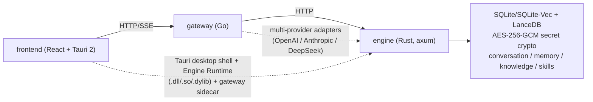

# EncoreHub

A cross-platform AI chat desktop app that aggregates multiple AI providers — with a local knowledge base, memory, character profiles, skills, plugins, and MCP support.

**聚合多家 AI 供应商的跨平台 AI 聊天桌面客户端**，支持知识库、记忆、角色档案、Skill、Plugin 与 MCP。

> Status: Active development. Core features are available, see [Features](#features) and [Roadmap](#roadmap).
> Unified backlog: [`docs/REMAINING_WORK.md`](docs/REMAINING_WORK.md).

<p align="center">
  <a href="#features">Features</a> ·
  <a href="#architecture">Architecture</a> ·
  <a href="#tech-stack">Tech Stack</a> ·
  <a href="#getting-started">Getting Started</a> ·
  <a href="#configuration">Configuration</a> ·
  <a href="#testing--building">Testing & Building</a> ·
  <a href="#documentation">Documentation</a> ·
  <a href="#roadmap">Roadmap</a> ·
  <a href="#license">License</a>
</p>

<p align="center">
  <b>🌐 Language: English</b> | <a href="README.zh-CN.md">简体中文</a>
</p>

---

## Badges

<p align="center">
  
  
  
  
  
  
</p>

---

## Features

- **Multi-provider**: Built-in OpenAI / Anthropic / DeepSeek with support for custom providers (base_url / model lists). Provider profiles persist in the engine and are hot-reloaded by the gateway
- **Streaming SSE**: Interruptible (Stop / Esc); reasoning / chain-of-thought is visible and collapsible
- **Token counting**: Assistant replies show total input+output tokens; the engine provides rough estimation plus API usage tracking
- **Local RAG**: Knowledge / Memory local vector retrieval (LanceDB primary index + SQLite-Vec fallback), auto-injected into context (top_k=3)
- **Web search**: Built-in `web_search` tool with DuckDuckGo / SearXNG / OpenSERP; `web_fetch` page reads are executed by Curl inside the Engine under SSRF policy
- **Character profiles**: Versioned character snapshots; character edits only affect new conversations
- **Optional secret encryption**: API keys stored AES-256-GCM encrypted (Argon2id-derived master key), kept in memory only
- **Auto titles**: Conversation titles generated after the first message; `/retitle` supported
- **Slash tool requests**: `/` opens LLM tool completion; `/web_search <query>` forces a pre-executed search
- **Developer mode**: Live status for engine / gateway / desktop, real-time logs (filter/search/export), runtime log-level control
- **Workspace UI**: Home is persistent; Workbench / Settings tabs can be opened and closed; keyboard-first (`Ctrl/Cmd + ,`)

## Architecture

```
frontend ──HTTP/SSE──▶ gateway ──HTTP──▶ engine (in-process, Rust)
   │                      │                  │
   │  Tauri desktop shell  │  multi-provider  │  SQLite/SQLite-Vec + LanceDB
   │  loads Engine Runtime │  adapters        │  AES-256-GCM + token counting
   │  (.dll/.so/.dylib)    │  + web search     │  + native doc parsing
```



In the desktop app, the Tauri executable loads the Engine Runtime dynamic library through a versioned C ABI (rather than static linking), while the Gateway runs as a child-process sidecar. HTML extraction is provided by a separately packaged RUSTScrapling dynamic library. The Engine can also be built as a standalone binary via the Cargo `standalone` feature for headless deployment, pure-web development, and CI.

> For background on the language split and process model, see [ADR-0001](docs/adr/0001-language-split.md), [ADR-0004](docs/adr/0004-engine-in-process-and-internal-auth.md), and [ADR-0008](docs/adr/0008-versioned-desktop-runtime-modules.md).

## Tech Stack

| Module | Language | Role |
|---|---|---|
| `frontend/` | TypeScript + React 18 + Tauri 2 | Desktop UI, streaming SSE, token counting, settings/skills/memory/knowledge/web-search/security/developer panels, Slash tool completion |
| `gateway/` | Go 1.25 (Gin) | HTTP/SSE entry, multi-provider adapters, built-in web search, auth/rate-limit/CORS, engine reverse proxy |
| `engine/` | Rust (axum + tokio + rusqlite + LanceDB) | Conversations, memory, knowledge, attachments, skills, secret storage; native doc parsing and chunking; vector retrieval |
| `proto/` | protobuf definitions | gRPC schema (**stubs not generated, not enabled**) |

## Getting Started

### Prerequisites

- Node 22+ / pnpm 10
- Go 1.25
- Rust stable
- [Tauri 2 platform system dependencies](https://v2.tauri.app/start/prerequisites/)
- Pandoc (optional): higher-fidelity rich-text conversion; the Engine falls back to native Rust parsers

> The standard build scripts prefer `PROTOC` or a `protoc` on PATH; otherwise Cargo resolves a vendored platform binary automatically. When running Cargo directly, you must set `PROTOC` yourself.

### Install & Run

```bash
# Install dependencies (workspace contract + engine deps)
pnpm setup

# Dev mode: build the current-platform Gateway sidecar and launch Tauri
pnpm dev
```

`pnpm dev` launches the desktop app: the Engine runs in-process (internal token auto-generated), and the Gateway runs as a sidecar. Open Settings (`Ctrl/Cmd + ,`) → Providers and enter an API key to start chatting.

Debug a single component:

```bash
pnpm dev:frontend   # Vite dev server (port 1420)
pnpm dev:gateway    # Gateway standalone
pnpm dev:engine     # Engine standalone
```

### Port Negotiation

- **Tauri / client mode**: when `ENGINE_BIND` and `LISTEN_ADDR` are unset, the desktop shell scans free ports upward from 10000 (engine first, then gateway); the frontend resolves only the Gateway port via the `get_service_ports` command
- **Headless / dev mode**: ports come from env vars (`ENGINE_BIND`, `LISTEN_ADDR`) or the loopback defaults `127.0.0.1:3000` / `127.0.0.1:8080`

## Configuration

Copy `.env.example` → `.env`:

| Variable | Default | Description |
|---|---|---|
| `LISTEN_ADDR` | `127.0.0.1:8080` | Gateway listen address |
| `ENGINE_URL` | `http://127.0.0.1:3000` | Gateway → Engine |
| `ENGINE_BIND` | `127.0.0.1:3000` | Engine listen address (`0.0.0.0:3000` in containers) |
| `ENCOREHUB_ENGINE_AUTH_TOKEN` | none | Internal Engine bearer token; required in standalone/Docker; auto-generated by Tauri per launch |
| `ENCOREHUB_AUTH_TOKEN` | _empty_ | When set, gateway requires `Authorization: Bearer …` on `/api/v1/*` |
| `ENCOREHUB_GATEWAY_HOST` | `127.0.0.1` | Compose Gateway host binding |
| `ENCOREHUB_CORS_ORIGINS` | _empty_ | Extra CORS origins (comma-separated) |
| `ENCOREHUB_RATE_LIMIT_RPS` / `BURST` | `30` / `60` | Per-IP rate limit and burst |
| `ENCOREHUB_RATE_LIMIT_TTL_SECONDS` / `MAX_CLIENTS` | `600` / `10000` | Limiter reaping and capacity |
| `ENCOREHUB_TRUSTED_PROXIES` | _empty_ | Trusted proxy IPs/CIDRs (comma-separated) |
| `ENCOREHUB_LANCEDB_PATH` | `<engine data>/lancedb` | LanceDB directory override |
| `ENCOREHUB_DEV_MOCK` | _empty_ | `1`/`true` enables mock replies without an API key (local only) |

Frontend uses `frontend/.env.example` → `.env.local`: `VITE_GATEWAY_URL` / `VITE_AUTH_TOKEN`. React never connects directly to Engine.

> AI provider API keys are entered through the frontend settings (via `X-Provider-Key` or the Engine vault), not read from the root `.env`.

## Testing & Building

```bash
# Quick check (no build output)
pnpm check

# Engine standalone + Gateway + Frontend
pnpm build

# Tests & Lint
pnpm test
pnpm test:docs
pnpm lint
pnpm format

# Docker
pnpm docker:build
pnpm docker:up
pnpm docker:ps
```

```bash
# Build the current-platform Engine Runtime, Gateway, and Tauri desktop app
./scripts/build.sh --tauri                # Unix / macOS / WSL
.\scripts\build.ps1 -Tauri               # Windows PowerShell

# Build Engine Runtime + Gateway without rebuilding the desktop app
./scripts/build.sh --components engine,gateway
.\scripts\build.ps1 -Components engine,gateway

# Upgrade only the Engine Runtime dynamic library
./scripts/build.sh --components engine
.\scripts\build.ps1 -Components engine
```

The `scripts/build.sh` / `scripts/build.ps1` scripts are the preferred build entrypoints and delegate to the same canonical `build-components.mjs` builder, so selection and validation are identical across Windows, Linux, and macOS. Common flags: `--debug` / `-Debug`, `--parallel` / `-Parallel`, and `--skip-install` / `-SkipInstall`. They also replace the legacy pnpm aliases `pnpm build:desktop` and `pnpm build:components -- --components <names>`.

CI configuration lives in `.github/workflows/ci.yml` and covers Docs, Frontend, Gateway, Engine, Windows/macOS/Linux Desktop, and Container gates. Frontend production builds validate the initial-load static JS dependency closure (default gzip budget 300 KiB).

## Documentation

- [`docs/openapi.json`](docs/openapi.json) — Gateway API contract
- [`docs/ARCHITECTURE_DIAGRAM.md`](docs/ARCHITECTURE_DIAGRAM.md) — runtime architecture, knowledge/memory and attachment routing
- [`docs/MEMORY_SYSTEM_DESIGN.md`](docs/MEMORY_SYSTEM_DESIGN.md) — single source of truth for the memory system
- [`docs/RUST_DATA_PIPELINE.md`](docs/RUST_DATA_PIPELINE.md) — Rust data pipeline and vector storage contract
- [`docs/conversation-title.md`](docs/conversation-title.md) — conversation title generation rules
- [`docs/adr/`](docs/adr/) — architecture decision records
- [`docs/REMAINING_WORK.md`](docs/REMAINING_WORK.md) — unified backlog and release acceptance checklist
- [`DEVELOPMENT_PLAN.md`](docs/DEVELOPMENT_PLAN.md) — overall blueprint

## Roadmap

- ✅ Multi-provider chat, streaming SSE, token counting, auto-generated titles
- ✅ Local Knowledge / Memory vector retrieval, file upload, secret encryption, port negotiation
- ✅ Web search and page reads, developer mode
- ⏳ Plugin WASM sandbox, hybrid ranking (FTS5 + vector), full gRPC pipeline

> Windows/macOS/Linux all build in CI with no-bundle smoke; each platform is treated as pre-release until its installed-app launch acceptance passes.

## License

Private repository. All rights reserved.
