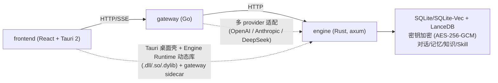

# EncoreHub

聚合多家 AI 供应商的跨平台 AI 聊天桌面客户端，支持知识库、记忆、角色档案、Skill、Plugin 与 MCP。

**A cross-platform AI chat desktop app** that aggregates multiple AI providers — with local knowledge base, memory, character profiles, skills, plugins, and MCP support.

> 状态 Status：早期开发 · Active development。核心功能可用，详见 [功能特性](#功能特性) 与 [路线图](#路线图)。
> 统一待办清单见 [`docs/REMAINING_WORK.md`](docs/REMAINING_WORK.md)。

<p align="center">
  <a href="#功能特性">功能特性</a> ·
  <a href="#架构">架构</a> ·
  <a href="#技术栈">技术栈</a> ·
  <a href="#快速开始">快速开始</a> ·
  <a href="#配置">配置</a> ·
  <a href="#测试与构建">测试与构建</a> ·
  <a href="#文档">文档</a> ·
  <a href="#路线图">路线图</a> ·
  <a href="#许可证">许可证</a>
</p>

<p align="center">
  <a href="README.md">English</a> | <b>🌐 简体中文</b>
</p>

---

## 徽章

<p align="center">
  
  
  
  
  
  
  
</p>

---

## 功能特性

- **多模型供应商 Multi-provider**：内置 OpenAI / Anthropic / DeepSeek，支持自定义供应商（base_url / 模型列表），档案持久化于引擎、网关热加载
- **流式 SSE**：可中断（Stop / Esc），reasoning / chain-of-thought 可见可折叠
- **Token 计数**：assistant 回复显示 input+output token 总数；引擎提供近似估算 + API 用量追踪
- **本地 RAG**：Knowledge / Memory 本地向量检索（LanceDB 主索引 + SQLite-Vec 回退），自动注入上下文（top_k=3）
- **联网搜索 Web Search**：内置 `web_search` 工具，DuckDuckGo / SearXNG / OpenSERP；`web_fetch` 网页读取由 Engine 内 Curl 执行并受 SSRF 策略约束
- **角色档案 Character Profiles**：版本化角色快照，角色编辑仅影响新对话
- **密钥加密（可选）**：API key 以 AES-256-GCM 加密落库（Argon2id 派生主密钥），仅驻内存
- **自动标题 Auto Titles**：首条消息后自动生成对话标题，支持 `/retitle`
- **Slash 工具请求**：`/` 打开 LLM 工具补全；`/web_search <query>` 强制预执行搜索
- **开发者模式 Developer Mode**：engine / gateway / desktop 三方存活状态、实时日志（过滤/搜索/导出）、运行时日志等级调整
- **工作区 UI**：Home 常驻，Workbench / Settings 标签可开关；键盘优先（`Ctrl/Cmd + ,`）

## 架构

```
frontend ──HTTP/SSE──▶ gateway ──HTTP──▶ engine (in-process, Rust)
   │                      │                  │
   │  Tauri 桌面壳         │  多 provider 适配 │  SQLite/SQLite-Vec + LanceDB
   │  Engine Runtime 动态库│  + 联网搜索       │  AES-256-GCM + token 计数
   │  (.dll/.so/.dylib)   │                  │  + 原生文档解析
```



桌面应用中，Tauri 可执行文件通过版本化 C ABI 加载 Engine Runtime 动态库（而非静态链接），Gateway 作为子进程 sidecar 运行；HTML 提取由独立打包的 RUSTScrapling 动态库提供。Engine 亦可通过 Cargo `standalone` feature 构建为独立二进制，用于 headless 部署、纯 Web 开发与 CI。

> 语言切分与进程模型的背景见 [ADR-0001](docs/adr/0001-language-split.md)、[ADR-0004](docs/adr/0004-engine-in-process-and-internal-auth.md)、[ADR-0008](docs/adr/0008-versioned-desktop-runtime-modules.md)。

## 技术栈

| 模块 | 语言 | 职责 |
|---|---|---|
| `frontend/` | TypeScript + React 18 + Tauri 2 | 桌面 UI、流式 SSE、token 计数、设置/Skill/Memory/Knowledge/Web Search/Security/Developer 面板、Slash 工具补全 |
| `gateway/` | Go 1.25 (Gin) | HTTP/SSE 入口，多 provider 适配，内置联网搜索工具，认证/限流/CORS，引擎反向代理 |
| `engine/` | Rust (axum + tokio + rusqlite + LanceDB) | 对话/记忆/知识/附件/Skill/密钥存储；Rust 文档解析与分块；向量检索 |
| `proto/` | protobuf 定义 | gRPC schema（**stub 未生成、未启用**） |

## 快速开始

### 前置要求

- Node 22+ / pnpm 10
- Go 1.25
- Rust stable
- [Tauri 2 对应平台的系统依赖](https://v2.tauri.app/start/prerequisites/)
- Pandoc（可选）：更高保真的富文本转换；未安装时 Engine 使用原生 Rust 解析器

> 标准构建脚本优先使用 `PROTOC` 或 PATH 中的 `protoc`；未安装时通过 Cargo 自动解析当前平台的 vendored binary。直接运行 Cargo 时需自行设置 `PROTOC`。

### 安装与运行

```bash
# 安装依赖（workspace contract + 引擎依赖）
pnpm setup

# 开发模式：构建当前平台 Gateway sidecar 并启动 Tauri
pnpm dev
```

`pnpm dev` 会启动桌面应用：Engine 在桌面进程内运行（内部 token 自动生成），Gateway 作为 sidecar。通过设置（`Ctrl/Cmd + ,`）→ Providers 填入 API key 即可对话。

只调试单个组件：

```bash
pnpm dev:frontend   # Vite dev server (port 1420)
pnpm dev:gateway    # Gateway 单独运行
pnpm dev:engine     # Engine standalone
```

### 端口协商

- **Tauri / client 模式**：`ENGINE_BIND` 与 `LISTEN_ADDR` 未设时，桌面壳从 10000 向上自动扫描可用端口（engine 先、gateway 后）；前端通过 `get_service_ports` command 只获取 Gateway 端口
- **Headless / dev 模式**：端口来自 env（`ENGINE_BIND`、`LISTEN_ADDR`）或 loopback 默认值 `127.0.0.1:3000` / `127.0.0.1:8080`

## 配置

复制 `.env.example` → `.env`：

| 变量 | 默认 | 说明 |
|---|---|---|
| `LISTEN_ADDR` | `127.0.0.1:8080` | gateway 监听 |
| `ENGINE_URL` | `http://127.0.0.1:3000` | gateway → engine |
| `ENGINE_BIND` | `127.0.0.1:3000` | engine 监听（容器里改 `0.0.0.0:3000`） |
| `ENCOREHUB_ENGINE_AUTH_TOKEN` | 无 | Engine 内部 Bearer token；standalone/Docker 必填；Tauri 每次启动自动生成 |
| `ENCOREHUB_AUTH_TOKEN` | _空_ | 设了则 gateway `/api/v1/*` 校验 `Authorization: Bearer …` |
| `ENCOREHUB_GATEWAY_HOST` | `127.0.0.1` | Compose 的 Gateway host binding |
| `ENCOREHUB_CORS_ORIGINS` | _空_ | 追加 CORS 来源（逗号分隔） |
| `ENCOREHUB_RATE_LIMIT_RPS` / `BURST` | `30` / `60` | 每 IP 限速与突发上限 |
| `ENCOREHUB_RATE_LIMIT_TTL_SECONDS` / `MAX_CLIENTS` | `600` / `10000` | limiter 回收与容量 |
| `ENCOREHUB_TRUSTED_PROXIES` | _空_ | 可信代理 IP/CIDR（逗号分隔） |
| `ENCOREHUB_LANCEDB_PATH` | `<engine data>/lancedb` | LanceDB 目录覆盖 |
| `ENCOREHUB_DEV_MOCK` | _空_ | `1`/`true` 时无 API key 也能拿到 mock 回复（仅本地） |

前端用 `frontend/.env.example` → `.env.local`：`VITE_GATEWAY_URL` / `VITE_AUTH_TOKEN`。React 不配置或直连 Engine。

> AI provider API keys 通过前端设置输入（`X-Provider-Key` 或引擎 vault），不从根 `.env` 读取。

## 测试与构建

```bash
# 快速检查（不产构建产物）
pnpm check

# Engine standalone + Gateway + Frontend
pnpm build

# 测试 & Lint
pnpm test
pnpm test:docs
pnpm lint
pnpm format

# Docker
pnpm docker:build
pnpm docker:up
pnpm docker:ps
```

```bash
# 构建当前平台的 Engine Runtime、Gateway 与 Tauri 桌面程序
./scripts/build.sh --tauri                # Unix / macOS / WSL
.\scripts\build.ps1 -Tauri               # Windows PowerShell

# 同时构建 Engine Runtime 与 Gateway，不重建桌面程序
./scripts/build.sh --components engine,gateway
.\scripts\build.ps1 -Components engine,gateway

# 仅升级 Engine Runtime 动态库
./scripts/build.sh --components engine
.\scripts\build.ps1 -Components engine
```

`scripts/build.sh` / `scripts/build.ps1` 是推荐的构建入口，统一委托给同一个 `build-components.mjs` 构建器，因此 Windows、Linux、macOS 上的组件选择与校验行为完全一致。常用参数：`--debug` / `-Debug`、`--parallel` / `-Parallel`、`--skip-install` / `-SkipInstall`。它们同时取代了旧的 pnpm 别名 `pnpm build:desktop` 与 `pnpm build:components -- --components <names>`。

CI 配置见 `.github/workflows/ci.yml`，覆盖 Docs、Frontend、Gateway、Engine、Windows/macOS/Linux Desktop 与 Container gate。Frontend production build 校验首屏静态 JS 依赖闭包（默认 gzip budget 300 KiB）。

## 文档

- [`docs/openapi.json`](docs/openapi.json) — Gateway API 契约
- [`docs/ARCHITECTURE_DIAGRAM.md`](docs/ARCHITECTURE_DIAGRAM.md) — 运行时架构、知识/记忆与附件路由
- [`docs/MEMORY_SYSTEM_DESIGN.md`](docs/MEMORY_SYSTEM_DESIGN.md) — 记忆系统唯一规范
- [`docs/RUST_DATA_PIPELINE.md`](docs/RUST_DATA_PIPELINE.md) — Rust 数据管线与向量存储契约
- [`docs/conversation-title.md`](docs/conversation-title.md) — 对话标题生成规则
- [`docs/adr/`](docs/adr/) — 架构决策记录
- [`docs/REMAINING_WORK.md`](docs/REMAINING_WORK.md) — 统一待办与发布验收清单
- [`DEVELOPMENT_PLAN.md`](docs/DEVELOPMENT_PLAN.md) — 总体蓝图

## 路线图

- ✅ 多供应商聊天、流式 SSE、token 计数、自动标题
- ✅ 本地 Knowledge / Memory 向量检索、文件上传、密钥加密、端口协商
- ✅ 联网搜索与网页读取、开发者模式
- ⏳ 插件 WASM 沙箱、混合排序（FTS5 + vector）、gRPC 全链路

> Windows/macOS/Linux 均进入 CI 编译与 no-bundle smoke；各平台完成安装后启动验收前视为预发布。

## 许可证

[Apache License 2.0](LICENSE) · Copyright © 2026 [CreationWong](mailto:creationwong@outlook.com)
