# EncoreHub Architecture Diagram

> Single comprehensive diagram covering code structure, features, and data flows.
> Rendered with [Mermaid](https://mermaid.js.org). Open in any Markdown viewer that supports Mermaid.

```mermaid
graph TB
    %% ===== STYLE =====
    classDef frontend fill:#3178c6,color:#fff,stroke:#235a97
    classDef gateway fill:#00add8,color:#fff,stroke:#007d99
    classDef engine fill:#dea584,color:#000,stroke:#b0724a
    classDef datasvc fill:#306998,color:#fff,stroke:#224b70
    classDef external fill:#6c757d,color:#fff,stroke:#495057
    classDef storage fill:#28a745,color:#fff,stroke:#1a6b2d
    classDef flow fill:#e83e8c,color:#fff,stroke:#b82e6e

    %% ===== USER LAYER =====
    subgraph USER["👤 User"]
        direction LR
        A1["Desktop App Window"]
        A2["Keyboard / Mouse"]
        A3["Chat Input"]
        A4["Settings Panel"]
    end

    %% ===== FRONTEND LAYER =====
    subgraph FRONTEND["🖥️ Frontend — TypeScript + React 18 + Tauri 2"]
        direction TB

        subgraph COMPONENTS["Components"]
            direction LR
            C1["App.tsx<br/>Root Layout"]
            C2["ChatView.tsx<br/>Message List"]
            C3["InputBox.tsx<br/>Text Input + /Cmd"]
            C4["MessageBubble.tsx<br/>Markdown Renderer"]
            C5["SlashCommandMenu.tsx<br/>Command Palette"]
            C6["Sidebar.tsx<br/>Theme + Nav"]
            C7["ConversationList.tsx<br/>Chat History"]
            C8["ProviderSwitcher.tsx<br/>Model Selector"]
            C9["SettingsModal.tsx<br/>Settings Shell"]
            C10["ProvidersPanel.tsx<br/>API Keys"]
            C11["SkillsPanel.tsx<br/>Skill Mgmt"]
            C12["MemoryPanel.tsx<br/>Memory Mgmt"]
            C13["KnowledgePanel.tsx<br/>Knowledge Base"]
            C14["AppearancePanel.tsx<br/>Theme Config"]
        end

        subgraph STORES["Zustand Stores"]
            direction LR
            S1["conversationStore<br/>• conversations[]<br/>• activeId<br/>• messages[]<br/>• streaming/loading<br/>• sendMessage()<br/>• stopStreaming()<br/>• optimistic rename"]
            S2["settingsStore<br/>• theme<br/>• provider/model<br/>• apiKeys{}<br/>• sidebarOpen<br/>• settingsOpen/tab"]
        end

        subgraph SERVICES["Services Layer"]
            direction LR
            V1["api.ts — apiFetch() + ApiError"]
            V2["config.ts — GATEWAY_URL / AUTH_TOKEN"]
            V3["chat.ts — SSE stream parser (delta/usage/error/done)"]
            V4["conversation.ts — CRUD"]
            V5["skills.ts / memories.ts / knowledge.ts"]
        end

        subgraph COMMANDS["Slash Commands"]
            direction LR
            M1["/new /clear /stop"]
            M2["/model /settings"]
            M3["/skills /memory /knowledge"]
            M4["/inspect /help"]
        end

        subgraph TAURI["Tauri Shell"]
            T1["src-tauri/main.rs<br/>in-process Engine + random token"]
            T2["tauri.conf.json<br/>externalBin: gateway"]
            T3["Plugins: shell, notification,<br/>clipboard, fs, global-shortcut"]
        end

        C1 --> C2
        C1 --> C6
        C2 --> C3
        C2 --> C4
        C3 --> C5
        C6 --> C7
        C6 --> C8
        C9 --> C10
        C9 --> C11
        C9 --> C12
        C9 --> C13
        C9 --> C14
        STORES --> COMPONENTS
        SERVICES --> STORES
        COMMANDS --> C5
        TAURI --- C1
    end

    %% ===== GATEWAY LAYER =====
    subgraph GATEWAY["🔀 Gateway — Go 1.25 + Gin"]
        direction TB

        subgraph MIDDLEWARE["Middleware Stack (order matters)"]
            direction LR
            W1["① Request-ID<br/>generate or pass through"]
            W2["② Logger + Recovery<br/>gin.Logger / gin.Recovery"]
            W3["③ CORS<br/>tauri://localhost + custom"]
            W4["④ Rate Limit<br/>bounded TTL per-IP store<br/>30 rps / burst 60"]
            W5["⑤ Metrics<br/>Prometheus counters + histogram"]
            W6["⑥ Auth<br/>Bearer token (optional)<br/>constant-time compare"]
        end

        subgraph HANDLERS["Handlers"]
            direction LR
            H1["health.go<br/>/health/live → 200<br/>/health/ready → 200/503"]
            H2["chat.go<br/>POST /conversations/:id/chat<br/>→ SSE stream"]
            H3["conversation.go<br/>CRUD proxy → engine"]
            H4["engine_proxy.go<br/>/*skills,memories,knowledge*/"]
            H5["provider_handler.go<br/>list providers + models"]
            H6["search_handler.go<br/>POST /search → DuckDuckGo"]
        end

        subgraph PROVIDERS["Provider Adapters"]
            direction LR
            P1["adapter.go<br/>Unified Interface"]
            P2["openai/openai.go"]
            P3["anthropic/anthropic.go"]
            P4["deepseek/deepseek.go"]
            P5["registry.go<br/>Provider Registry"]
        end

        subgraph GW_INFRA["Infrastructure"]
            direction LR
            G1["engine/client.go<br/>HTTP client → Rust engine<br/>internal Bearer + X-Request-ID"]
            G2["metrics/metrics.go<br/>encorehub_gateway_requests_total<br/>encorehub_gateway_request_duration_seconds<br/>encorehub_gateway_in_flight_requests"]
            G3["search/search.go<br/>DuckDuckGo integration"]
        end

        MIDDLEWARE --> HANDLERS
        HANDLERS --> PROVIDERS
        HANDLERS --> GW_INFRA
    end

    %% ===== ENGINE LAYER =====
    subgraph ENGINE["⚙️ Engine — Rust (axum + tokio + rusqlite)"]
        direction TB

        subgraph API["API Routes (src/api/)"]
            direction LR
            R0["GET /health/live → public liveness"]
            R1["GET /health/ready → authenticated DB readiness"]
            R2["POST/GET /api/conversations"]
            R3["GET/PATCH/DELETE /api/conversations/:id"]
            R4["POST /api/conversations/:id/messages"]
            R5["GET/POST /api/skills + /match + /toggle"]
            R6["GET /api/memories + /search + DELETE"]
            R7["GET /api/knowledge + /search + POST + DELETE"]
            R8["GET/POST /api/plugins"]
        end

        subgraph CRATES["Cargo Workspace Crates"]
            direction LR
            K1["core<br/>EngineError + Types"]
            K2["storage<br/>Database abstraction"]
            K3["skill<br/>SkillRegistry + Parser"]
        end

        subgraph STORAGE_BACKENDS["Storage Backends"]
            direction LR
            B1["SQLite (rusqlite bundled)<br/>conversations / messages<br/>memories / knowledge / skills<br/>config key-value"]
            B2["LanceDB (placeholder)<br/>vector search for RAG"]
            B3["Blob (placeholder)<br/>file attachments"]
        end

        subgraph ENG_BINS["Binaries"]
            direction LR
            EB1["encorehub-engine<br/>main HTTP server :3000"]
            EB2["encorehub-mcp<br/>MCP server (skeleton)"]
        end

        API --> CRATES
        CRATES --> STORAGE_BACKENDS
    end

    %% ===== DATA SERVICES LAYER =====
    subgraph DATASVC["🐍 Data Services — Python 3.12 + FastAPI (skeleton)"]
        direction LR
        D1["main.py<br/>FastAPI app :8000"]
        D2["__init__.py"]
        D3["Planned: RAG / embedding<br/>document parsing / chunking"]
    end

    %% ===== EXTERNAL =====
    subgraph EXTERNAL["🌐 External Services"]
        direction LR
        E1["OpenAI API<br/>api.openai.com"]
        E2["Anthropic API<br/>api.anthropic.com"]
        E3["DeepSeek API<br/>api.deepseek.com"]
        E4["DuckDuckGo<br/>Web Search"]
        E5["Redis<br/>Cache + Message Queue"]
    end

    %% ===== CONNECTIONS: Frontend → Gateway =====
    FRONTEND -->|"HTTP REST + SSE<br/>:8080/api/v1/*"| GATEWAY

    %% ===== CONNECTIONS: Gateway → Engine =====
    GATEWAY -->|"HTTP JSON + internal Bearer<br/>:3000 (ENGINE_URL)<br/>conversations / skills<br/>memories / knowledge"| ENGINE

    %% ===== CONNECTIONS: Gateway → Providers =====
    GATEWAY -->|"HTTPS + API Key<br/>X-Provider-Key header"| EXTERNAL

    %% ===== CONNECTIONS: Gateway → Search =====
    GATEWAY -->|"HTTPS"| E4

    %% ===== CONNECTIONS: Engine → Storage =====
    ENGINE -->|"embedded"| B1

    %% ===== CONNECTIONS: Data Services =====
    DATASVC -.->|"planned"| ENGINE
    DATASVC -.->|"planned"| E5

    %% ===== FLOW ANNOTATIONS =====
    subgraph FLOWS["📊 Key Data Flows"]
        direction TB
        F1["💬 Chat Flow:<br/>User → InputBox → apiFetch()<br/>→ Gateway POST /chat<br/>→ Provider Adapter.ChatStream()<br/>→ SSE delta events → MessageBubble"]
        F2["📝 CRUD Flow:<br/>Frontend Service → Gateway<br/>→ Engine Proxy / Handler<br/>→ SQLite → JSON response"]
        F3["🔍 RAG Context Injection:<br/>Each chat request: memory.search()<br/>+ knowledge.search() → top_k=3<br/>→ appended to system prompt"]
        F4["⚡ Slash Command Flow:<br/>User types '/' → SlashCommandMenu<br/>→ matchCommands(prefix)<br/>→ run(args, {conv, settings})"]
        F5["🔑 API Key Flow:<br/>Settings Modal → settingsStore<br/>→ session memory (default)<br/>→ X-Provider-Key header<br/>→ Gateway → Provider API"]
    end

    %% ===== CROSS-CUTTING =====
    subgraph CROSSCUT["🔧 Cross-Cutting Concerns"]
        direction LR
        X1["X-Request-ID<br/>generated at gateway<br/>propagated to engine"]
        X2["Health Check<br/>Gateway live + ready<br/>Engine /health/live public<br/>Engine /health/ready authenticated"]
        X3["Prometheus /metrics<br/>public, no auth"]
        X4["Biome (frontend lint)"]
        X5["golangci-lint (gateway)"]
        X6["clippy + rustfmt (engine)"]
        X7["ruff + mypy (data-services)"]
        X8["GitHub Actions CI<br/>4 parallel jobs"]
    end
```

## Legend

| Color | Layer |
|-------|-------|
| Blue | Frontend (TypeScript/React) |
| Cyan | Gateway (Go/Gin) |
| Orange | Engine (Rust/Axum) |
| Dark Blue | Data Services (Python) |
| Gray | External Services |
| Green | Storage |

## Reading Guide

1. **Top to bottom**: User → Frontend → Gateway → Engine → Storage
2. **Solid arrows** (→): active HTTP/HTTPS connections
3. **Dotted arrows** (-.->): planned / not yet wired
4. **Data Flows** panel at bottom-right: key interaction patterns

## Component Count (June 2026)

| Layer | Source Files | Test Files |
|-------|-------------|------------|
| Frontend | 20 `.tsx` + 12 `.ts` | 8 test files |
| Gateway | 14 `.go` | 4 test files |
| Engine | 15 `.rs` | 2 test files |
| Data Services | 2 `.py` | 0 |
| **Total** | **63** | **14** |
