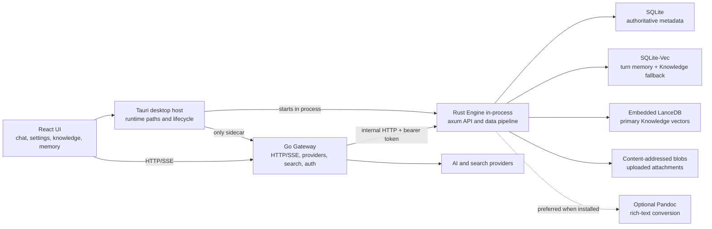
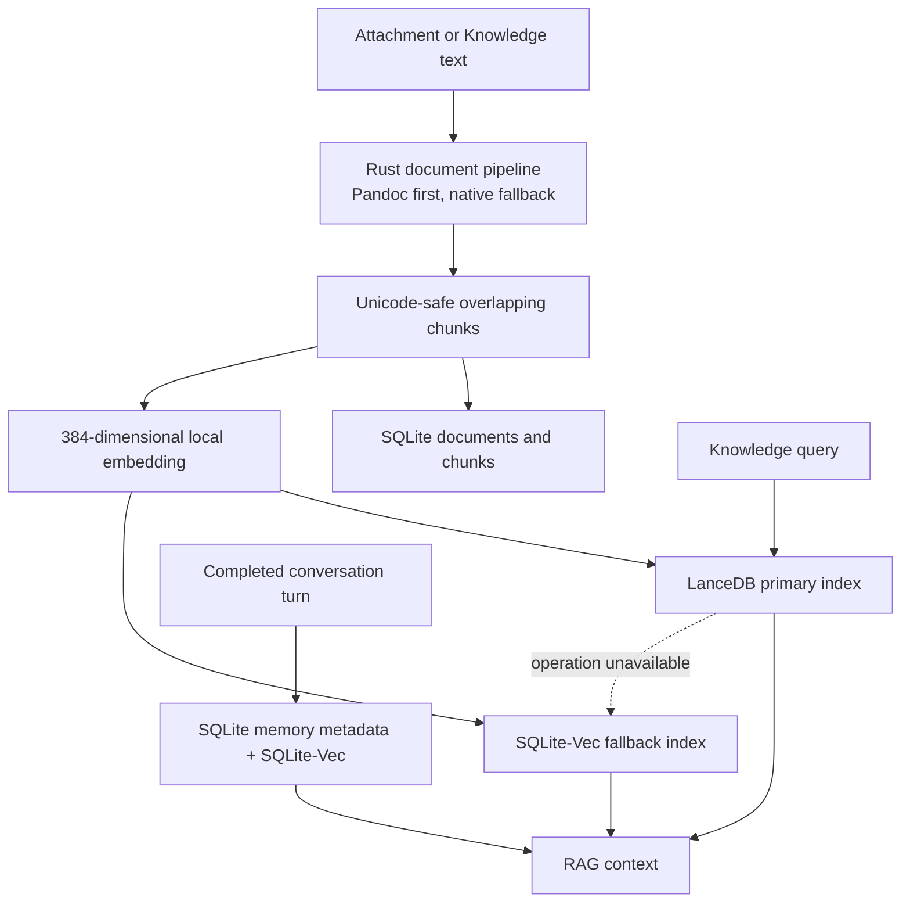
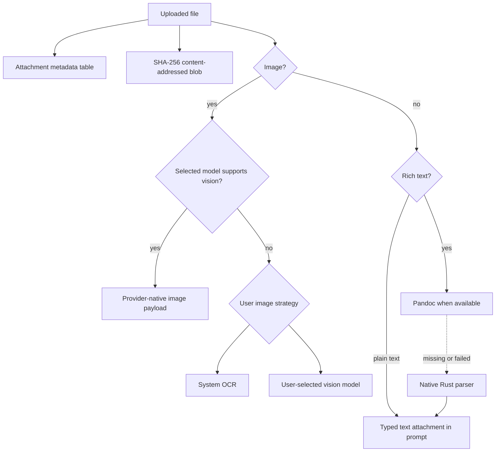

# EncoreHub Architecture

> Current runtime architecture as of 2026-08-05. Historical design choices are
> recorded under `docs/adr/`; implementation follow-up lives in
> [`REMAINING_WORK.md`](REMAINING_WORK.md).

## Runtime Topology

The frontend never connects directly to Engine. Tauri negotiates loopback ports
and exposes only the Gateway port to React. A per-start random bearer token
protects all Engine business and readiness routes; `/health/live` is the only
unprotected Engine endpoint.

## Knowledge And Memory

SQLite owns lifecycle and metadata. LanceDB and SQLite-Vec are local vector
projections. Knowledge writes always mirror into SQLite-Vec before LanceDB, so
retrieval remains available after a primary-store failure. Per-turn Memory uses
SQLite-Vec directly because its dataset is small and follows SQLite lifecycle.

## Attachment Routing

## Build And Deployment

- Desktop packages the Gateway as the only sidecar; Engine is a linked Rust
  library running on Tauri's async runtime.
- Mutable SQLite, LanceDB, blobs, and logs live under platform app data, never
  the installation resource directory.
- Standalone Engine remains available behind Cargo's `standalone` feature.
- LanceDB builds require `protoc`; local build scripts resolve a vendored binary
  when `PROTOC` and PATH do not provide one, while CI and Docker install it.
- Containers publish Gateway only; Engine and all embedded stores stay on the
  private Compose network and persistent Engine volume.
