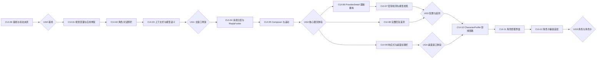

# EncoreHub 客户端页面优化工作流

> 制定日期：2026-07-24
> 输入计划：[CLIENT_UI_OPTIMIZATION_PLAN.md](CLIENT_UI_OPTIMIZATION_PLAN.md)
> 集成分支：`UI`
> 目标：把客户端页面优化计划转换为可独立提交、可验证、可回滚的实施单元

## 1. 执行原则

### 1.1 产品边界

- 在现有 React、Zustand、Gateway、Engine 和 Tauri 结构上增量修改，不重写聊天链路或 Settings 导航。
- 主窗口严格采用“顶部全局导航 + 角色/对话侧栏 + 上下文栏 + 消息流 + 输入区”的五区结构，不引入活动栏或新的一级工作区。
- Settings 的一级导航、供应商中间列表和右侧详情三栏结构保持不变；供应商工作只重构右侧 `ProviderDetail`。
- 第一阶段的“角色”只允许显示由现有 Provider/Model 投影出的默认角色，不显示无法工作的添加、导入或编辑入口。
- 检测密钥、远程发现模型、完整回复遥测和角色卡导入必须先完成真实契约，再在界面显示对应命令。
- Windows 自定义标题栏在普通布局完成后接入；macOS/Linux 在平台验收前继续使用原生窗口装饰。
- UI 文案、状态与行为以真实数据为准；未知 token、耗时、结束原因和模型能力不显示占位值，也不根据名称猜测。

### 1.2 工程边界

- `UI` 是本轮集成分支。每个 `CUI-*` 从最新 `UI` 建立短生命周期工作分支，完成后合回 `UI`。
- 每个工作项必须形成一条可运行的垂直链路，包含行为、测试、必要文档和视觉验收证据。
- 同时进行的工作项上限为 2；不得并行修改 `ChatView`/`MessageBubble` 或 `ProvidersPanel` 的同一片区域。
- 数据库和 API 变更只做向后兼容的增量扩展。迁移代码合入前必须验证旧数据加载和代码回滚路径。
- 不通过提高 bundle budget、跳过测试、删除 a11y 断言或隐藏溢出来获得绿色结果。
- 不记录 API key、角色提示词、消息正文、模型响应正文或带 query 的完整 URL。

### 1.3 工作项状态

| 状态 | 进入条件 | 退出条件 |
|---|---|---|
| `Not started` | 依赖未完成或尚未认领 | 依赖满足，范围与验收人明确 |
| `Ready` | 可开始，接口决策已明确 | 建立工作分支并记录改前基线 |
| `In progress` | 正在实现或补测试 | 专项测试、截图和自查完成 |
| `In review` | 变更与证据齐全 | 审查意见处理完成 |
| `Verified` | 对应 Gate 全部通过 | 合入 `UI` 并在集成分支复验 |
| `Done` | `UI` 复验通过且文档已更新 | 无 |
| `Blocked` | 缺少必要契约、平台或产品决策 | 阻塞解除后回到 `Ready` |

## 2. 里程碑与依赖



### 2.1 Gate 定义

| Gate | 必须满足 | 解锁内容 |
|---|---|---|
| UG0 基线 | 固定视口、状态夹具、亮暗主题基线和现有聊天 smoke 已保存 | 开始结构改造 |
| UG1 主窗口骨架 | 顶部导航、双标签侧栏、上下文栏和三段主区稳定；现有聊天可完整使用 | 消息流与输入区改造 |
| UG2 核心聊天体验 | reasoning、answer、tool、token footer、composer、IME 和滚动状态通过 | 供应商、遥测和桌面专项工作 |
| UG3 配置与遥测 | 密钥检测、模型发现、保存语义和完整回复指标跨重载一致；日志无 secret | 角色领域工作 |
| UG4 桌面窗口体验 | 680x480 至 1600x1120 布局通过；Windows 窗口控制实机通过；其他平台无双标题栏 | 角色领域工作 |
| UG5 角色与角色卡 | 角色提示词真实进入请求；旧对话不静默漂移；角色卡可预览且未知字段无损保留 | UI 分支进入主分支候选 |

### 2.2 交付节奏

| 迭代 | 工作项 | 目标 | 预计投入 |
|---|---|---|---:|
| UI 迭代 A | CUI-00 至 CUI-05 | 复现参考布局并完成现有聊天能力迁移 | 5-7 天 |
| 配置迭代 B | CUI-06 至 CUI-08 | 供应商详情、模型发现和回复遥测 | 3-5 天 |
| 桌面迭代 C | CUI-09 | 响应式布局和 Windows 自定义标题栏 | 2-3 天 |
| 角色迭代 D | CUI-10 至 CUI-12 | 角色全局提示词、版本快照和角色卡基础兼容 | 5-8 天 |

## 3. 执行总表

| ID | 主要模块 | 依赖 | 交付物 | 初始状态 |
|---|---|---|---|---|
| CUI-00 | Frontend QA | 无 | 固定状态夹具、截图基线、现有行为清单 | `Ready` |
| CUI-01 | Frontend shell/styles | CUI-00 | 视觉 tokens、顶部导航结构、三段主工作区 | `Not started` |
| CUI-02 | Frontend sidebar/store | CUI-01 | 角色/对话 tabs、默认角色、列表分组与折叠 | `Not started` |
| CUI-03 | Frontend context/provider semantics | CUI-02 | 上下文栏、对话权威 Provider/Model 语义 | `Not started` |
| CUI-04 | Frontend messages | UG1 | UserBubble、ReasoningSection、AnswerBody、ReplyFooter | `Not started` |
| CUI-05 | Frontend composer/scroll | CUI-04 | 一体式输入区、Slash a11y、滚动控制与分会话草稿 | `Not started` |
| CUI-06 | Frontend settings | UG2 | ProviderDetail 纵向表单、手工模型管理、draft 保存 | `Not started` |
| CUI-07 | Gateway + Frontend | CUI-06 | key validation、remote model discovery 与差异确认 | `Not started` |
| CUI-08 | Engine + Gateway + Frontend | UG2 | usage 拆分、生成耗时、结束原因持久化与展示 | `Not started` |
| CUI-09 | Frontend + Tauri | UG2 | 响应式侧栏、低高度模式、Windows 窗口控制 | `Not started` |
| CUI-10 | Engine + Gateway + Frontend contracts | UG3 + UG4 | CharacterProfile、版本、快照、prompt composition | `Not started` |
| CUI-11 | Frontend character UI | CUI-10 | 角色创建、编辑、复制、删除与对话版本升级 | `Not started` |
| CUI-12 | Engine/domain adapter + Frontend | CUI-11 | JSON/PNG 角色卡导入导出、预览、冲突处理 | `Not started` |

## 4. UI 迭代 A：主聊天界面

### CUI-00 固定基线与状态夹具

**目标**：让后续评审比较同一组视口和状态，而不是凭单张理想截图判断。

**任务**

- [ ] 固定 `1600x1120`、`1200x800`、`900x700`、`680x480` 四个视口。
- [ ] 为亮色与暗色准备空对话、短对话、长 Markdown、长代码、reasoning、tool call、流式、停止和失败状态。
- [ ] 准备超长对话标题、角色名、Provider 名、Model 名和 0/未知/大 token 数样本。
- [ ] 记录当前新建、切换、删除、重命名、发送、停止、搜索和打开设置的 smoke 结果。
- [ ] 确认视觉验收方式：优先使用可重复的浏览器截图脚本；暂未引入 Playwright 时保存 in-app Browser 的同视口截图和操作记录。
- [ ] 将夹具限制在测试或开发环境，不把假角色、假模型和假 token 混入生产状态。

**完成定义**

- 四个视口均有可重复的改前基线。
- 后续工作项可以通过同一夹具复现布局问题。
- 不改变运行时聊天行为和持久化数据。

### CUI-01 建立视觉变量与应用骨架

**目标**：先形成参考图的页面结构，但暂不关闭任何平台的原生窗口装饰。

**建议提交**

1. `style(frontend): add client workspace design tokens`
2. `feat(frontend): add top navigation and chat workspace shell`

**任务**

- [ ] 在 `globals.css` 和 `tailwind.config.js` 增加 app canvas、workspace、control surface、selected surface 与文字层级 token。
- [ ] 将 `App.tsx` 调整为固定顶部导航和下方“侧栏 + 主工作区”结构。
- [ ] 新建顶部导航组件；Web 模式不渲染窗口按钮，Tauri 窗口按钮在 CUI-09 前保持未启用。
- [ ] 本阶段只显示已接通的首页、新对话、外观和设置命令；完整“角色”管理入口延后到 CUI-11。
- [ ] 保留 Settings 懒加载、UnlockGate、ConfirmDialog、ToastHost 和服务启动门禁。
- [ ] 将 `ChatView` 拆出 `ContextHeader`、`MessageFeed`、`Composer` 布局槽；本项只迁移现有行为。
- [ ] 使用稳定的 grid/flex 约束固定 64px 顶栏、主区 header 和 composer，不让加载状态改变整体尺寸。

**专项验证**

- App 启动、Settings 快捷键、UnlockGate 与空状态测试。
- 四个目标视口的亮暗截图。
- 首屏 JavaScript gzip 继续不超过 300 KiB。

**回滚条件**

- 新骨架阻断服务启动、Settings 或聊天时，整体回滚结构提交；视觉 token 可单独保留。

### CUI-02 实现“角色 / 对话”侧栏

**目标**：侧栏只负责选择角色或对话，不再承载 Provider、主题和设置底栏。

**建议提交**

1. `feat(frontend): add character and conversation sidebar tabs`
2. `feat(frontend): group and manage conversation list`

**任务**

- [ ] 使用 `tablist/tab/tabpanel` 实现等宽“角色 / 对话”标签，并持久化上次选择；新安装默认“对话”。
- [ ] 新建 `CharacterList`，只渲染从当前 Provider/Model 投影的默认角色；隐藏添加、导入和删除命令。
- [ ] 对话列表按今天、昨天、过去 7 天和更早分组，保留现有标题更新和选中逻辑。
- [ ] 将重命名、重新生成标题和删除放入更多菜单；双击重命名可以保留但不作为唯一入口。
- [ ] 侧栏宽度限制为 260-380px；折叠后完全隐藏，不保留 48px 图标栏。
- [ ] tabs 切换只替换侧栏 pane，不卸载 `ChatView`，不丢失流式状态、输入草稿或滚动位置。
- [ ] 为加载、空、错误、单项、多项和超长文本补测试。

**完成定义**

- 默认角色可以选择并进入最近对话或空白对话。
- 对话列表的创建、选择、重命名、重新生成标题和删除功能无回归。
- 键盘可切换 tabs、列表项和更多菜单，Escape 后焦点返回触发按钮。

### CUI-03 迁移上下文栏与模型语义

**目标**：发送前明确显示当前角色、Provider 和 Model，并消除全局设置与已有对话权威元数据的错配。

**任务**

- [ ] 将 `ProviderSwitcher` 从侧栏移入 `ContextHeader`，显示默认角色、Provider 和 Model。
- [ ] 无活动对话时，选择器修改新对话默认值。
- [ ] 有活动对话时，显示 `Conversation.provider/model`，不直接显示 `settingsStore` 当前值。
- [ ] 在已有对话选择其他模型时，明确确认“使用该模型新建对话”；不得只改界面标签。
- [ ] 将收起侧栏、专注模式和现有低频会话命令接入真实行为。
- [ ] 对话内搜索、会话参数等未实现能力不显示。
- [ ] 对角色名、Provider 名和 Model 名分别设置收缩与截断边界。

**专项测试**

- 新对话默认模型与已有对话权威模型的分支测试。
- 切换模型创建新对话、取消切换和 Provider 不可用测试。
- 900px 与 680px 下长名称不遮挡命令。

**UG1 验收**

- 顶部导航、侧栏、上下文栏、消息区和输入区边界与计划一致。
- 使用默认角色和现有 Conversation 可以完成新建、发送、停止、切换和重载。
- 主聊天区没有不可用的假按钮。

### CUI-04 重构消息层级与 ReplyFooter

**目标**：每一轮按“用户消息 -> 思考过程 -> 工具记录 -> 最终回复 -> 本轮操作/状态”显示。

**建议提交**

1. `refactor(frontend): split chat message presentation`
2. `feat(frontend): move reply tokens into message footer`

**任务**

- [ ] 将 `MessageBubble` 拆为 `UserBubble`、`ReasoningSection`、`ToolExecutionList`、`AnswerBody` 和 `ReplyFooter`。
- [ ] 用户消息改为右侧紧凑中性气泡，模型回复改为左侧无卡片文档流。
- [ ] reasoning 流式时默认展开；完成后保留当前展开状态；历史首次载入默认折叠。
- [ ] 未持久化 duration 前，历史只显示“已处理”；不得伪造耗时。
- [ ] 将现有 `Message.token_count` 移到每轮 assistant 回复右下角，0 或未知时不显示。
- [ ] `ReplyFooter` 左侧先提供复制最终回复；重新生成、分享、分支和导出在真实 turn 语义完成前不显示。
- [ ] 工具调用使用紧凑执行记录，保留 pending、completed 和 failed 状态。
- [ ] 保持 Markdown、表格和代码块可横向容纳；复制代码按钮有 tooltip 和 `aria-label`。

**专项测试**

- user/assistant/system/tool、reasoning、空答案、流式、停止、失败和 token 边界测试。
- 复制最终回复只复制 answer，不混入 reasoning 或工具结果。
- 窄窗 footer 换行后状态仍右对齐，按钮点击区不缩小。

### CUI-05 完成 Composer、草稿与滚动控制

**目标**：输入区和消息滚动在长对话、流式输出和多对话切换时保持稳定。

**建议提交**

1. `feat(frontend): unify chat composer controls`
2. `fix(frontend): preserve chat drafts and scroll positions`

**任务**

- [ ] 将 textarea、Slash、联网搜索、字符状态和发送/停止合并为单个 composer 容器。
- [ ] textarea 默认两行，最大 220px；达到字符上限 85% 后才显示进度状态。
- [ ] 搜索开关与 Provider 选择合并到同一菜单，未接通的附件、图片和 MCP 按钮不显示。
- [ ] Slash 菜单向上展开并补齐 `listbox/option`、活动项关联、分组、Escape 和焦点返回。
- [ ] 中文输入法组合态下 Enter 不发送；发送和停止图标切换不改变按钮尺寸。
- [ ] 为每个 Conversation 保存独立草稿；新对话使用独立临时 key，创建成功后迁移草稿。
- [ ] 用距离底部约 96px 的阈值判断自动跟随，使用 requestAnimationFrame 节流流式滚动。
- [ ] 用户向上阅读时暂停跟随并显示“回到最新”图标按钮；每个对话保存独立滚动位置。
- [ ] 侧栏切换、侧栏折叠和专注模式不重置 composer 或滚动状态。

**UG2 验收**

- 长对话、长代码、工具调用、停止和失败状态不造成布局位移或内容遮挡。
- 流式时可以切换到其他对话编辑草稿，返回后两边状态均正确。
- 680x480 下仍能看到上下文、消息和可操作的发送/停止按钮。
- Frontend 类型检查、lint、全量 Vitest、production build 和截图矩阵通过。

## 5. 配置迭代 B：供应商与回复遥测

### CUI-06 重构 ProviderDetail 基础表单

**目标**：保持现有 Settings 三栏骨架，把右侧详情改为 API Key -> API 地址 -> 模型的纵向流程。

**建议提交**

1. `refactor(frontend): restructure provider detail form`
2. `feat(frontend): add manual provider model management`

**任务**

- [ ] 保留 `SettingsModal` 一级导航和 `ProvidersPanel` 中间列表，不新建全屏供应商页。
- [ ] 将 enabled 移到详情标题行；builtin 删除保持禁用，custom 删除保留确认。
- [ ] 使用本地 draft 管理 key 状态、base URL、enabled 和 models；只有脏且校验通过时允许保存。
- [ ] API Key 区复用 secrets vault 的未设置、会话可用、加密保存和已锁定状态；锁定时使用固定掩码。
- [ ] API 地址使用统一 helper 规范化尾部 `/`、已有 `/v1`、本地地址和自定义路径，并显示请求地址预览。
- [ ] 模型列表改为单个分组容器中的固定高度行，支持本地搜索、手工添加、去重、取消和移除。
- [ ] “检测”和“获取模型列表”在 CUI-07 契约可用前不显示。
- [ ] 放弃更改恢复服务端 profile；保存继续通过现有完整 profile PUT，不做逐键自动提交。

**安全检查**

- key 不进入 React 持久化、toast、console、URL、测试快照或日志。
- URL 错误只记录 provider id、protocol 和错误类别，不记录 query 或响应正文。

**完成定义**

- builtin/custom、draft/persisted、locked/unlocked 和窄窗状态均可恢复。
- 手工模型添加、移除和保存刷新后保持一致。

### CUI-07 增加密钥检测与远程模型发现

**目标**：把“检测”和“获取模型列表”实现为两个无副作用命令。

**接口检查点**

- `POST /api/v1/providers/{provider}/validate-key` 只回答凭据与连接是否有效。
- `POST /api/v1/providers/{provider}/models/discover` 返回远端候选，不直接写入 profile。
- 临时 key 继续通过现有 `X-Provider-Key` secret header 传递；draft base URL 可以放在结构化请求体中，但不得写日志。
- discovery 返回 `discovery_supported`、候选模型和结构化错误；不支持时保留手工添加。

**建议提交**

1. `feat(gateway): expose provider key validation`
2. `feat(gateway): add remote model discovery contract`
3. `feat(frontend): connect provider probe actions`

**任务**

- [ ] 扩展 Gateway route、handler、provider adapter 和 OpenAPI；不改变现有 `ListModels` 的已配置模型语义。
- [ ] 允许检测当前 draft URL 和临时 key，命令结束后不持久化 key 或 profile。
- [ ] 对超时、401/403、限流、不支持 discovery、无模型和畸形响应使用可区分错误类别。
- [ ] 前端为检测、发现和保存维护独立 pending 状态，不锁死只读区域。
- [ ] 发现结果先显示“新增 / 保留 / 将移除”差异；只有用户确认后更新本地 draft。
- [ ] 远端失败、空响应或取消不得清空本地模型列表。
- [ ] 为官方文档和“获取密钥”使用 Tauri shell/系统浏览器；Web 模式使用安全外链降级。

**契约测试**

- key 正确、错误、缺失、vault 锁定和临时 key 不持久化。
- discovery 支持、不支持、超时、重复模型、空结果和远端失败。
- canary key、响应正文和完整 URL 不出现在 Gateway/Tauri 导出日志中。

### CUI-08 持久化完整回复遥测

**目标**：刷新后仍能按 `tokens/s -> tokens -> duration -> stop reason` 显示真实状态。

**数据检查点**

- 对 Message 增加可选 `input_tokens`、`output_tokens`、`duration_ms` 和 `finish_reason`；保留 `token_count` 兼容旧客户端与旧记录。
- 旧记录只显示已有合计 token，不反推 input/output、耗时或结束原因。
- `duration_ms` 只累计 provider 生成时间，不包含等待用户确认工具结果的时间。
- `tokens/s` 仅在 `output_tokens > 0` 且 `duration_ms > 0` 时计算。

**建议提交**

1. `feat(engine): persist assistant reply telemetry`
2. `feat(gateway): propagate usage timing and finish reason`
3. `feat(frontend): render persisted reply metrics`

**任务**

- [ ] 使用 additive SQLite migration 扩展 Message storage、API request/response 和旧数据默认值。
- [ ] Gateway 聚合 provider usage、每段生成耗时和最终 finish reason，并在持久化与 SSE done 中使用同一权威值。
- [ ] 工具循环分段计时；工具执行等待不计入生成 duration。
- [ ] Frontend 乐观消息、流式完成、重载和失败回滚都使用同一遥测类型。
- [ ] `ReplyFooter` 按真实字段逐项渲染；原始 finish reason 放 tooltip，异常使用语义状态色。
- [ ] 限制未知或异常大数值的展示宽度，使用 tabular numbers，避免 footer 跳动。

**迁移与回滚测试**

- 旧数据库迁移、旧记录读取、新记录写入和新旧字段并存。
- 正常停止、用户取消、provider 错误、tool loop 和无 usage provider。
- 代码回滚时新增 nullable 列不影响旧版本读取。

**UG3 验收**

- 检测、发现和保存三种命令状态互不混淆。
- 远端失败不破坏本地 profile，secret canary 扫描通过。
- 新回复刷新后完整指标不丢失，旧回复保持兼容降级。
- Frontend、Gateway、Engine、OpenAPI/docs 契约与全仓 gate 通过。

## 6. 桌面迭代 C：响应式与标题栏

### CUI-09 完成响应式布局和 Windows 自定义标题栏

**目标**：在不破坏 macOS/Linux 原生窗口行为的前提下完成参考图顶部窗口结构。

**实施顺序**

1. 先在保留原生 decorations 的情况下完成响应式布局。
2. 接入并实测 Tauri 拖拽、双击和窗口控制。
3. 仅在 Windows smoke 全部通过后关闭 Windows 原生 decorations。
4. macOS/Linux 保留原生标题栏，并隐藏应用内重复的系统窗口按钮。

**任务**

- [ ] `900-1199px` 收窄侧栏与上下文次要文字；`680-899px` 使用覆盖抽屉。
- [ ] 高度低于 620px 时启用 104px composer 和更紧凑消息间距。
- [ ] 抽屉支持遮罩、Escape、滚动锁定和关闭后的焦点返回。
- [ ] 使用 `data-tauri-drag-region` 标记空白区，并明确排除所有交互控件。
- [ ] 接入最小化、最大化/还原、关闭和空白区双击行为；Web 模式隐藏窗口按钮。
- [ ] 使用 Windows 平台配置或运行时分支控制 decorations，不使用影响三平台的单一全局开关。
- [ ] 保留一个可快速恢复原生 decorations 的回滚路径。

**实机矩阵**

| 平台 | 必测内容 |
|---|---|
| Windows | 拖动、双击、最小化、最大化、还原、关闭、缩放比例、多显示器边缘 |
| macOS | 原生交通灯保留、无双标题栏、拖动和全屏不回归 |
| Linux | 原生装饰保留、主流窗口管理器下无重复控制、680px 最小宽度可用 |
| Web | 无系统窗口按钮，响应式抽屉与键盘流程完整 |

**UG4 验收**

- 1600x1120、1200x800、900x700、680x480 的亮暗主题无重叠、裁切或不可达命令。
- Windows 安装包实机窗口 smoke 通过后才允许关闭 decorations。
- macOS/Linux 未完成安装 smoke 前不声明对应平台发布支持。

## 7. 角色迭代 D：角色与角色卡

### CUI-10 建立 CharacterProfile 领域链路

**目标**：让“角色”成为可审计的一等实体，而不是 Provider/Model 的显示别名。

**领域检查点**

- 代码实体命名为 `CharacterProfile`，关联字段为 `character_id`，避免与 `Message.role` 冲突。
- 最小字段包含名称、头像、描述、全局提示词、默认 provider/model、开场白、标签、版本号和更新时间。
- Conversation 保存 `character_id`、角色版本和提示词快照；角色修改默认只影响新对话。
- system prompt 顺序固定为：应用约束 -> 角色内容 -> Skill -> Memory/Knowledge -> 工具说明。

**建议提交**

1. `feat(engine): add versioned character profiles`
2. `feat(engine): snapshot characters on conversations`
3. `feat(gateway): compose character prompts for chat`
4. `feat(frontend): add character service and store contracts`

**任务**

- [ ] 定义版本化 schema、SQLite additive migration、CRUD API 和 OpenAPI。
- [ ] 创建默认角色迁移或运行时投影，确保现有对话在升级后仍可加载。
- [ ] 创建 Conversation 时原子保存角色 id、版本、prompt 快照和最终 provider/model。
- [ ] Gateway 从 Conversation 快照构造请求，不能每次读取角色最新版本覆盖旧对话。
- [ ] 提供显式“升级角色版本”API，返回变更预览并创建新的快照。
- [ ] 对 prompt 段使用结构化边界，角色卡文本不能提升工具或安全权限。

**契约测试**

- 默认角色、新角色、角色修改后新旧对话差异、角色删除与历史对话保留。
- prompt 组合顺序、空字段、超长限制、恶意指令文本和日志 canary。
- 迁移前数据库、迁移后回滚和并发创建 Conversation。

### CUI-11 实现角色管理界面

**目标**：角色 tab 从默认投影升级为完整的创建、选择和版本管理入口。

**任务**

- [ ] 接通“添加角色”，提供名称、头像、描述、开场白、默认模型和大尺寸全局提示词编辑器。
- [ ] 提供保存、复制配置、删除和测试对话；默认角色不可删除。
- [ ] 显示提示词 token 估算与变量帮助，估算值不得冒充 provider usage。
- [ ] 角色选择打开最近对话或空白新对话；新对话继承角色默认配置。
- [ ] 角色版本变化时，旧对话显示当前快照与可选升级预览，不自动更新。
- [ ] CharacterProfile 可用后才在顶部导航显示完整“角色”管理入口。
- [ ] 补空、加载、错误、名称冲突、模型不可用和超长提示词状态。

**完成定义**

- 创建角色后可以发起真实对话，Gateway 收到正确 prompt 快照。
- 修改角色不会改变既有对话；显式升级后版本和快照同步更新。
- 全程键盘可操作，头像缺失和长 CJK 名称不会破坏布局。

### CUI-12 建立 Tavern/SillyTavern 角色卡适配器

**目标**：通过领域适配器兼容 JSON 与 PNG metadata，并保证未知扩展可往返保留。

**兼容契约**

- 页面组件不直接解析角色卡 JSON 或 PNG metadata。
- JSON 与 PNG 进入同一规范化管线，输出内部 `CharacterProfile` 加保留的原始扩展数据。
- 首期映射名称、头像、description、personality、scenario、first message、example dialogue、system prompt、post-history instructions、alternate greetings、tags 和 extensions。
- 未知字段原样保留；导入后再导出不得无故丢失。

**任务**

- [ ] 固定支持的角色卡版本和字段映射文档，加入公开许可的脱敏样例夹具。
- [ ] 实现 JSON parser/serializer、PNG metadata reader/writer 和统一校验错误。
- [ ] 设置文件大小、图片尺寸、文本长度、嵌套深度和解压/解析资源上限。
- [ ] 导入前显示字段预览、版本、未知扩展和同名冲突；默认创建新角色。
- [ ] 导出明确选择 JSON 或 PNG，保留原始未知字段与 extensions。
- [ ] 禁止执行脚本、HTML、远程资源或角色卡中的工具授权指令。
- [ ] 对损坏 PNG、畸形 base64、重复 metadata、未知版本和超限内容补回归测试。

**UG5 验收**

- 角色全局提示词按固定顺序进入真实请求，角色版本与对话快照可审计。
- JSON/PNG 导入均有预览和冲突处理；样例往返测试证明未知字段保留。
- 导入内容不执行脚本、不访问远程资源、不扩大工具权限且不进入日志。
- UI、Gateway、Engine、Tauri、契约测试和安装 smoke 全部通过。

## 8. 标准工作循环

每个 `CUI-*` 按以下顺序执行：

1. 从最新 `UI` 建立 `ui/cui-xx-short-name` 分支，确认上游 Gate 已通过。
2. 在工作项记录改前行为、目标视口、涉及状态和明确非目标。
3. 先增加失败测试或可重复的视觉/交互复现。
4. 实现最小垂直改动，不夹带无关 store、service 或样式重构。
5. 运行组件专项测试，再运行本节对应的模块 gate。
6. 保存亮暗主题和目标视口截图；动态行为附操作记录或 Tauri smoke 结果。
7. 检查键盘、IME、焦点返回、长文本、加载、错误和 reduced motion。
8. 更新计划、工作流状态、OpenAPI、ADR 或平台说明。
9. 使用 `type(scope): description` 创建英文提交，合回 `UI` 后复跑 Gate。

### 8.1 允许并行的工作

- UG2 后，CUI-07 和 CUI-08 可以并行，但需要分别拥有 Provider 与 Message 契约文件，合并 OpenAPI 时统一复核。
- CUI-09 可以与 CUI-07/08 并行，但不得同时重构 `App.tsx`、`ContextHeader` 或全局视觉 tokens。
- CUI-10 至 CUI-12 必须顺序执行，不能在 CharacterProfile schema 未稳定时先做角色卡页面。

### 8.2 暂停合并的条件

- Conversation 权威 Provider/Model 语义仍不明确。
- UI 按钮没有真实 API 或本地行为。
- 数据迁移没有旧数据库夹具和回滚验证。
- secret、prompt 或消息 canary 出现在日志、toast、console 或测试产物中。
- 680x480 出现遮挡，或键盘无法到达主操作。
- Windows 自定义标题栏任一拖动/窗口控制 smoke 失败。

## 9. 验证矩阵

### 9.1 Frontend 工作项

```powershell
pnpm --dir frontend check
pnpm --dir frontend lint
pnpm --dir frontend test -- --run
pnpm --dir frontend build
```

每个工作项先运行受影响组件的 Vitest，再运行以上完整 gate。`build` 必须继续通过 300 KiB 初始 JavaScript gzip 预算。

### 9.2 跨栈工作项

```powershell
# Gateway
Set-Location gateway
go vet ./...
go test ./...

# Engine
Set-Location ..\engine
cargo fmt --all -- --check
cargo clippy --workspace --all-targets -- -D warnings
cargo test --workspace

# Tauri
Set-Location ..\frontend\src-tauri
cargo fmt --check
cargo clippy --all-targets -- -D warnings
cargo test
```

CUI-07、CUI-08、CUI-10 和 CUI-12 还必须运行 `pnpm test:docs`，确保 OpenAPI、路由和本地文档链接同步。

### 9.3 UI 状态矩阵

| 区域 | 必测状态 |
|---|---|
| 侧栏 | 角色/对话、空、加载、错误、单项、多项、长名称、菜单、折叠、抽屉 |
| 上下文栏 | 新对话、已有对话、Provider 不可用、长模型名、切换确认、专注模式 |
| 消息 | user、assistant、system、tool、reasoning、streaming、stopped、failed、旧记录 |
| ReplyFooter | 无 token、仅合计 token、完整遥测、超长 finish reason、复制成功/失败 |
| Composer | 空、长输入、85% 警戒、IME、Slash、搜索、发送、停止、跨对话草稿 |
| ProviderDetail | builtin/custom、draft、locked、检测中、发现中、保存中、远端失败、脏数据 |
| 角色 | 默认、新建、版本变化、模型失效、删除、升级预览、导入冲突、损坏角色卡 |

### 9.4 合并前仓库检查

```powershell
pnpm check
pnpm test
pnpm lint
pnpm test:docs
git diff --check
git status --short
```

生成的截图、bundle 报告和安装包只有在仓库已有明确归档位置时才提交；临时产物不得污染工作区。

## 10. 审查清单

每个工作项在合入 `UI` 前必须回答：

- [ ] 对应哪个 `CUI-*`、计划阶段和 Gate？
- [ ] 改动前如何复现，改动后由什么测试或截图证明？
- [ ] 是否保留现有聊天、Settings 和 provider 行为？
- [ ] 是否显示了没有真实数据或命令的控件？
- [ ] Conversation、CharacterProfile、Provider 和 Message 的权威状态分别在哪里？
- [ ] 流式、停止、失败、重载和跨对话切换时状态如何恢复？
- [ ] 是否影响 API、数据库 schema、secret、日志、窗口装饰或平台行为？
- [ ] 键盘、IME、焦点返回、长 CJK 文本和 reduced motion 是否验收？
- [ ] 四个目标视口和亮暗主题是否保存证据？
- [ ] 专项测试、模块 gate 和合并后 Gate 是否通过？
- [ ] 回滚是否会丢失角色、对话、provider 配置或新遥测字段？

## 11. 回滚原则

| 风险 | 预防 | 回滚方式 |
|---|---|---|
| 新骨架阻断聊天 | CUI-01 只迁移布局，行为保持原 store/service | 回滚 shell 组件，保留无行为影响的 tokens |
| Provider/Model 显示错配 | 新对话默认值与已有对话权威值分支测试 | 恢复原选择器并禁止已有对话内切换 |
| 流式滚动抢夺阅读位置 | 距底阈值、RAF 节流、分会话状态测试 | 关闭自动跟随，仅保留“回到最新” |
| Provider probe 泄露 key | secret header、redacted 日志和 canary | 下线 probe route/UI，不影响已保存 profile |
| 遥测迁移破坏旧消息 | nullable additive migration、保留 token_count | 前端忽略新字段；数据库列保留不删除 |
| 自定义标题栏不可操作 | 原生 decorations 最后关闭并保留平台分支 | Windows 恢复原生 decorations |
| 角色修改污染历史 | Conversation 保存版本与 prompt 快照 | 禁止升级入口，继续读取旧快照 |
| 角色卡解析消耗或执行内容 | 大小/深度限制、纯数据 parser、无远程访问 | 禁用导入入口，保留 CharacterProfile 本身 |

## 12. 完成定义

客户端页面优化工作流在以下条件全部满足时完成：

- [ ] CUI-00 至 CUI-12 均为 `Done`，UG1 至 UG5 在 `UI` 分支通过。
- [ ] 主窗口与供应商详情分别符合输入计划的 Image #1 和 Image #2 结构，不引入计划外一级导航。
- [ ] 现有聊天、搜索、标题、secrets、Settings 和日志功能无回归。
- [ ] 每轮回复 token 位于右下角；存在完整真实数据时显示 tokens/s、tokens、duration 和 stop reason。
- [ ] 角色具有真实全局提示词、版本和 Conversation 快照，不再只是 Provider/Model 别名。
- [ ] 角色卡适配具有版本契约、限制、预览、冲突处理和未知字段往返测试。
- [ ] 目标视口、亮暗主题、键盘、IME 和 reduced motion 验收通过。
- [ ] Windows 安装后窗口 smoke 通过；macOS/Linux 的发布声明与各自安装 smoke 证据一致。
- [ ] Frontend bundle budget、全仓测试、OpenAPI/docs 契约和 secret 日志 canary 全部绿色。
- [ ] `UI` 合入主分支前生成一份最终视觉对比和平台验收记录。

## 13. 第一批工作安排

第一批只启动 CUI-00，完成基线后顺序推进 CUI-01 和 CUI-02。三项都会触碰主窗口或全局样式，不并行实施。

建议首批提交顺序：

1. `test(frontend): add client ui state fixtures`
2. `style(frontend): add client workspace design tokens`
3. `feat(frontend): add top navigation and workspace shell`
4. `feat(frontend): add character and conversation sidebar tabs`

UG1 通过前不开始 ProviderDetail、回复遥测、自定义标题栏或 CharacterProfile，确保每次结构变化都能在完整聊天链路中单独验证。
