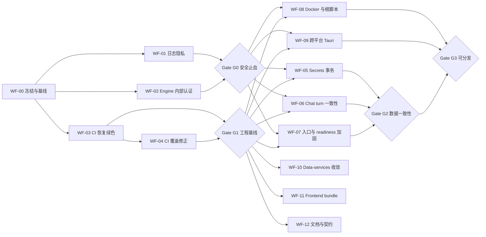

# EncoreHub 改进工作流程计划

> 制定日期：2026-07-12
> 输入报告：[IMPROVEMENT_REPORT.md](IMPROVEMENT_REPORT.md)
> 关联路线图：[REMAINING_WORK.md](REMAINING_WORK.md)
> 目标：把 2 个 P0、9 个 P1、5 个 P2 转换为可独立合并、可验证、可回滚的工作流

## 1. 工作原则

### 1.1 当前发布策略

- **立即冻结发布**：在 Gate G0 和 G1 同时通过前，不生成新的可分发版本。
- **暂停高风险功能开发**：聊天上下文、RAG、向量检索和 secrets 新功能先暂停，避免继续扩大不稳定的接口。
- **允许两条修复线并行**：安全止血与 CI 恢复可由不同负责人同时推进，但不得并行修改同一核心文件。
- **小步垂直交付**：每个 PR 必须包含行为、测试和必要文档，不合并只有半条链路的跨模块改动。
- **测试先行但不合并红灯**：先在本地写出失败测试，再在同一 PR 中修复；主分支不接收故意失败的 test-only PR。
- **不降低 gate**：不能通过删除 lint 规则、跳过 job、放宽断言或隐藏错误来恢复绿色。

### 1.2 工作项状态

每个工作项只使用以下状态：

| 状态 | 进入条件 | 退出条件 |
|---|---|---|
| `Not started` | 尚未满足依赖或未认领 | 负责人确认范围和验收标准 |
| `Ready` | 依赖已满足，接口决策已明确 | 开始实现并记录基线 |
| `In progress` | 已有负责人和工作分支 | PR 已建立且自测完成 |
| `In review` | PR 描述、测试证据、回滚方案齐全 | 审查意见解决 |
| `Verified` | CI 与专项验收通过 | 合并并完成主分支复验 |
| `Done` | 主分支 gate 通过，文档已更新 | 无 |
| `Blocked` | 外部决策或环境缺失阻止推进 | 阻塞条件解除并重新进入 `Ready` |

### 1.3 标准 PR 流程

1. 从本文件认领一个 PR 单元，确认上游依赖已经 `Done`。
2. 在 PR 描述中写明对应报告编号、失败场景、非目标和回滚方法。
3. 运行最小复现，记录修复前结果。
4. 添加失败测试或可重复 smoke script。
5. 实现最小垂直改动，不夹带无关重构。
6. 先运行模块专项测试，再运行本文件第 9 节的完整 gate。
7. 更新受影响的 ADR、README、环境变量示例或接口文档。
8. 审查者按安全、数据一致性、兼容性、可观测性四个维度检查。
9. 合并后在主分支复跑 gate；只有复验通过才把工作项标记为 `Done`。

## 2. 里程碑与依赖



### 2.1 Gate 定义

| Gate | 必须满足 | 解锁内容 |
|---|---|---|
| G0 安全止血 | Engine 非 health 路由强制内部认证；任意 origin 不可读 secrets；日志 canary 不落盘；compose 不发布 engine | 允许进入数据正确性与发布修复 |
| G1 工程基线 | 五个 CI job 绿色；Rust workspace 与 Tauri 进入 gate；主分支 clean-tree | 允许常规修复与低风险 UI 工作 |
| G2 数据一致性 | Secrets 故障回滚通过；chat 失败/中止/重载一致；tool usage 权威化 | 允许继续对话智能层开发 |
| G3 可分发 | Docker clean build/smoke；Windows 安装验收；声明支持的其他 OS 通过 smoke | 允许生成发布候选版本 |
| G4 维护收敛 | Data-services 基线、bundle budget、文档契约检查进入 CI | 恢复全部路线图开发 |

### 2.2 与现有路线图的关系

| `REMAINING_WORK.md` 区域 | 处理方式 | 恢复条件 |
|---|---|---|
| 手动验收 1.1-1.4 | 并入 WF-09 和 Gate G3 | G0、G1 已通过 |
| 对话智能层 2.3-2.5 | 暂停 | WF-06 完成且 Gate G2 通过 |
| Data-services 3.1-3.6 | 先做 WF-10 的最小工程基线 | G1 与 WF-10 完成 |
| 向量检索 4.1-4.5 | 暂停 | Data-services 接口和打包决策稳定 |
| 契约与文档 5.1-5.4 | 并入 WF-12，且每个 PR 增量更新 | G1 后可持续推进 |
| UI 6.1-6.9 | G1 后可恢复；bundle 相关改动并入 WF-11 | 不得阻塞 G0-G3 |

## 3. 执行总表

| ID | 优先级 | 对应报告 | 建议负责模块 | 依赖 | 预计投入 | 初始状态 |
|---|---|---|---|---|---:|---|
| WF-00 | P0 | 全部 | Maintainer | 无 | 0.5 天 | `Ready` |
| WF-01 | P0 | P0-2 | Gateway + Desktop | WF-00 | 0.5-1 天 | `In review`（本地验收完成） |
| WF-02 | P0 | P0-1 | Engine + Gateway + Desktop | WF-00 | 1-2 天 | `In review`（本地验收完成，待 Docker smoke） |
| WF-03 | P1 | P1-7 | 各模块维护者 | WF-00 | 1 天 | `In review`（四个本地 CI gate 绿色） |
| WF-04 | P1 | P1-8 | CI + Rust/Desktop | WF-03 | 0.5-1 天 | `In review`（本地验收完成，待远端 CI） |
| WF-05 | P1 | P1-1 | Engine storage/crypto | G0 + G1 | 1-2 天 | `In review`（本地验收完成，待远端 CI） |
| WF-06 | P1 | P1-2 + P2-2 | Gateway + Engine + Frontend | G0 + G1 | 3-5 天 | `In review`（本地验收完成） |
| WF-07 | P1 | P1-3 + P1-4 + P1-9 | Gateway + Engine | G0 + G1 | 1-2 天 | `In review`（本地 gate 绿色，待 Docker smoke） |
| WF-08 | P1 | P1-5 + P2-1 | Infra/Build | G0 + G1 | 1-2 天 | `In review`（本地 gate 绿色，待 Docker CI smoke） |
| WF-09 | P1 | P1-6 | Desktop/Release | G0 + G1 | 3-5 天 | `In review`（Windows 本地 build 绿色，待三平台安装 smoke） |
| WF-10 | P2 | P2-3 | Python/Infra | G1 | 1-2 天 | `In review`（本地 gate 绿色，待 Data Services profile smoke） |
| WF-11 | P2 | P2-4 | Frontend | G1 | 1-2 天 | `In review`（首屏 gzip budget 本地通过，待远端 CI） |
| WF-12 | P2 | P2-5 | Maintainer | G1；可随前序 PR 增量执行 | 1-2 天 | `In review`（文档契约本地通过，待远端 CI） |

## 4. Milestone M0：安全止血

M0 与 M1 可由不同负责人并行执行。M0 完成前持续冻结发布；安全改动必须包含端到端 tracer bullet，不能只修 CORS 或只隐藏端口。

### WF-00 冻结与基线登记

**目标**：建立单一执行看板，防止修复过程中继续扩大影响面。

**任务**

- [ ] 在项目 issue tracker 建立 WF-01 至 WF-12，保持本文件 ID 不变。
- [ ] 给 P0 工作项标记 stop-ship，并冻结 release tag/installer 分发。
- [ ] 把第 9 节命令结果附到 WF-00，记录已知红灯，不把既有失败误归因于后续 PR。
- [ ] 指定 Engine/Gateway/Desktop 三个区域的审查者。
- [x] 约定内部 token 的配置名、header、轮换和 health 例外。

**完成定义**

- 工作项有负责人、依赖和验收人。
- P0 期间没有新 feature PR 合并到受影响模块。

### WF-01 移除 payload 日志并建立隐私回归测试

**建议 PR 切分**

1. `fix(gateway): stop logging chat and title payloads`
2. `test(desktop): reject conversation canaries in persisted logs`

**任务**

- [x] 删除 tool-loop Info 日志中的完整 `ChatRequest`。
- [x] 删除标题失败日志中的 request、response 和 raw 字段。
- [x] Provider error 只保留状态、错误类别、长度和 request ID。
- [x] 保留 round、message count、tool count、模型和长度等非内容元数据。
- [x] 在 gateway、Tauri 和 frontend 测试中注入唯一 canary，检查日志不包含原文。
- [x] 检查 DeveloperPanel 导出路径也使用同一 redacted 数据。

**执行记录（2026-07-12）**

- Gateway 新增安全日志 module：外部错误只记录 category/type/length/status，tool loop、title 和 search 只记录计数与长度。
- Tauri 对含 `request/response/raw/prompt/system_prompt/content/query/tool_result` 字段的遗留 sidecar 日志整行替换；同一 redacted entry 同时进入内存、文件和 DeveloperPanel 导出。
- Frontend conversation store 不再把原始 API/stream error 送入 console bridge，只记录 error type 与 length。
- Red-green 证据：三个 canary 测试在修改前均失败，修改后均通过。
- 已通过：Gateway WF-01 专项测试、`go vet ./...`、Tauri 11 个测试与 clippy、Frontend 129 个测试与 production build。
- 全局 gate 仍有两个审计基线阻塞：Gateway 混合标题断言失败、Frontend lint 29 个 error；均归属 WF-03，本次没有扩大错误数。
- 当前状态保持 `In review`；合并并在 WF-03 恢复全局 CI 后才能进入 `Verified/Done`。

**专项验证**

```powershell
cd gateway
go test ./internal/handler/...

cd ..\frontend\src-tauri
cargo test logs::tests
```

**回滚条件**

- 不因缺少 payload 而恢复原始内容日志。诊断不足时只能增加结构化元数据或显式 opt-in trace sink。

### WF-02 建立 Engine 内部认证并关闭浏览器直连

**设计检查点**

- 内部 token 只在 Tauri shell、gateway 和 engine 之间传递，绝不进入 React bundle、日志或 SQLite。
- 推荐桌面启动时生成随机 token；standalone/Docker 从 secret/env 注入，不提供硬编码默认值。
- `/health/live` 可公开；`/health/ready` 和所有业务路由默认强制认证。
- Engine 不承担浏览器 API，默认移除 CORS；确有需求时使用严格 allowlist。

**认证契约（2026-07-12）**

- 配置名固定为 `ENCOREHUB_ENGINE_AUTH_TOKEN`，请求使用 `Authorization: Bearer <token>`。
- Tauri 每次启动使用 OS CSPRNG 生成 256-bit token，只保存在 Rust 进程内存并注入 Gateway 子进程；不通过 Tauri command、React 配置、日志或 SQLite 暴露。
- Standalone/Docker 由部署环境注入同一个至少 256-bit 随机值，不提供默认 token；缺失或空值时 Engine 与 Gateway 均在监听端口前退出。
- `/health/live` 是唯一公开 Engine 路由；`/health/ready` readiness 和所有 `/api/*` 路由默认强制认证。
- token 生命周期等于桌面进程或一次部署 secret 版本；轮换时 Engine 与 Gateway 必须作为一个部署单元同时重启。

**建议 PR 切分**

1. `feat(engine): require internal bearer token`
2. `feat(desktop): provision engine token to gateway sidecar`
3. `fix(compose): keep engine on the internal network`

**任务**

- [x] 在 Engine router 增加统一 auth middleware，而非逐 handler 检查。
- [x] Engine client 自动附带内部 token，并覆盖所有调用方法。
- [x] Tauri 生成 token，分别交给进程内 engine 与 gateway sidecar。
- [x] Standalone 启动缺少 token 时 fail closed，并输出不含 token 的配置错误。
- [x] 移除 Engine `CorsLayer::allow_origin(Any)`。
- [x] Compose 删除 engine 的 host `ports`，gateway 默认只绑定 loopback；显式网络部署另给 profile/example。
- [x] 添加 secrets/config/conversation 的未认证、错 token、正确 token、恶意 origin 测试。

**执行记录（2026-07-12）**

- Engine 将公开 `/health/live` 与受保护 router 分离；统一 middleware 对 readiness、secrets、config、conversation 及其余业务路由校验内部 Bearer，空 router token 也保持 fail closed，并完全移除 Engine CORS layer。
- Gateway `engine.Client` 集中注入内部 Bearer，覆盖 typed JSON、secret 读取、health 和透明 proxy；外部 `ENCOREHUB_AUTH_TOKEN` 开关不改变内部凭据。Gateway 默认监听改为 `127.0.0.1:8080`，缺内部 token 时不启动。
- Tauri 每次启动生成 32-byte OS 随机 token，同时传给进程内 Engine 和 Gateway command env；受保护的文件日志等级写入也携带凭据。启动路由配置只下发 Gateway 端口，`VITE_ENGINE_URL` 和 Engine URL helper 已删除；DeveloperPanel 可显示 Engine 端口状态，但不接收内部 token。
- Compose 要求显式提供 `ENCOREHUB_ENGINE_AUTH_TOKEN`，Engine 仅 `expose: 3000` 而不发布 host port，Gateway host mapping 默认使用 `127.0.0.1`；文档中的网络部署示例要求显式覆盖并配置独立外部 token。
- 已通过：Engine 7 个单元测试、18 个 API 集成测试、fmt、clippy；Tauri 13 个测试、fmt、clippy；Gateway WF-02 专项测试与 `go vet ./...`；Frontend 129 个测试与 production build。
- 安全扫描通过：React source/production bundle 不含内部 token 配置名、`VITE_ENGINE_URL` 或直连 `:3000` URL；Engine source 不含 CORS layer；Compose YAML 结构化检查确认 Engine 无 `ports` 且两端强制同一 secret。
- Fail-closed smoke 通过：Standalone Engine 和 Gateway 在缺少 `ENCOREHUB_ENGINE_AUTH_TOKEN` 时均在监听前退出，错误只包含配置名，不包含 token 值。
- 当前环境没有 Docker CLI，尚未执行 `host:3000 -> connection refused` 与容器内 Gateway -> Engine 的运行时 smoke；因此状态保持 `In review`。
- 全局 gate 仍有 WF-03 基线问题：Gateway 混合标题长度断言失败，Frontend lint 当前报告 27 个既有错误；WF-02 专项 gate 没有新增失败。

**专项验证**

```text
GET /health/live                         -> 200
GET /api/secrets/openai (no token)       -> 401/403
GET /api/secrets/openai (wrong token)    -> 401/403
GET /api/secrets/openai (valid token)    -> 按 vault 状态返回
Origin: https://evil.example             -> 无可读 CORS 响应
host:3000 under docker compose           -> connection refused
```

**回滚条件**

- 跨模块 token 传递失败时整体回滚该 tracer bullet，发布继续冻结；不得以临时关闭 engine auth 作为发布修复。

## 5. Milestone M1：恢复可信工程基线

### WF-03 修复当前红灯

**建议 PR 切分**

1. `chore(frontend): restore biome baseline`
2. `fix(gateway): align mixed title length contract`
3. `chore(engine): restore rustfmt baseline`
4. `test(data): establish executable Python checks`

**任务**

- [x] 修复 29 个 Biome error；a11y 问题必须行为修复，不能 blanket ignore。
- [x] 明确混合标题是“最多 15 rune”还是“按语义词组截断”，同步实现、prompt 和测试。
- [x] 运行 rustfmt 并确认只有预期格式变更。
- [x] 把 Python 工具移到 `[dependency-groups].dev`，或 CI 显式安装 `--extra dev`。
- [x] 给 `health_check` 增加返回类型和至少一个 API test。
- [x] 生成并提交 `uv.lock`；CI 使用 `--frozen`。
- [x] `go mod tidy` 后增加 clean-tree 检查。

**执行记录（2026-07-15）**

- Frontend 实际复测基线为 27 个 Biome diagnostics；安全格式与导入修复后，`delete`、非空断言和测试字面键使用等价的类型安全写法。确认框从带 `role="dialog"` 的 `div` 改为原生 `<dialog>`，通过 `showModal`、`cancel` 事件、标题关联和初始取消焦点保留键盘与可访问行为，并新增 2 个回归测试；没有使用 blanket ignore。
- 混合标题契约固定为最多 15 个 Unicode rune，空格和标点计入。中文 20 rune、英文 15 词、混合 15 rune 与英文 100 rune safety cap 使用共享常量，生成 prompt、标题工具描述、实现和测试已同步；不引入不稳定的中文分词启发式。
- Engine 仅有 `engine/crates/conversation/src/token.rs` 一处 rustfmt 机械变更，完整 fmt、clippy、默认/standalone 测试和 release build 均通过。
- Data Services 将 ruff、mypy、pytest 与 pytest-asyncio 移入 `[dependency-groups].dev`；`health_check` 增加 `dict[str, str]` 返回类型，并以 `httpx.AsyncClient + ASGITransport` 增加无弃用警告的 API 测试。
- `data-services/uv.lock` 锁定 169 个解析包；本地已通过 `uv lock --check`、`uv sync --frozen --group dev`、ruff、strict mypy 和 pytest。Docker runtime 也从同一 lock 使用 `uv sync --frozen --no-dev`。
- CI 现在使用 frozen pnpm/uv 安装，Python lint/type-check 覆盖 `src/` 与 `tests/`，所有 `uv run` 禁止重解锁；Gateway 在 `go mod tidy` 后执行完整 `git diff --exit-code`。
- Frontend gate：Biome 检查 61 个文件、18 个测试文件共 131 个测试、production build 全部通过。bundle 大小与动态 import 警告归属 WF-11，不影响本项基线。
- Gateway gate：`go mod tidy` clean-tree、`go vet ./...`、`go test ./...` 和 gateway build 全部通过。
- Engine gate：`cargo fmt --all -- --check`、standalone clippy、默认/standalone 测试及 release build 全部通过。
- Data Services gate：ruff、strict mypy 与 1 个 API test 全部通过且无测试警告。
- 当前尚未推送触发 GitHub Actions，状态保持 `In review`；合并前需确认四个远端 job 与上述本地等价 gate 一致。

**完成定义**

- 四个现有 CI job 在不跳步的情况下通过。
- 本地完整 gate 与 CI 结果一致。

### WF-04 修正测试覆盖范围

**任务**

- [x] Engine test 使用 `cargo test --workspace`。
- [x] Engine clippy 使用 `--workspace --all-targets`，单独验证 standalone feature。
- [x] Frontend CI 增加 `frontend/src-tauri` 的 `cargo check` 和 `cargo test`。
- [x] 增加 Windows job覆盖 Windows-only process/sidecar 代码。
- [x] 生成测试清单，确认 conversation、storage、skill、engine、Tauri 均在 CI 输出中出现。

**执行记录（2026-07-15）**

- 修复前 `cargo test -- --list` 只列出 Engine 根包的 26 个测试；`cargo test --workspace -- --list` 列出 50 个，确认旧 CI 漏掉 conversation 16 个、skill 1 个和 storage 7 个测试。
- Engine CI 现在分别执行 workspace clippy、standalone target clippy、workspace test 和 standalone target test；release build 显式构建两个 standalone binaries。
- Frontend Linux job安装 Tauri 系统依赖并构建真实的 `gateway-x86_64-unknown-linux-gnu` sidecar，然后执行 Tauri check、test inventory 和 test。
- 新增 `desktop-windows` job，构建真实的 `gateway-x86_64-pc-windows-msvc.exe`，编译 Windows `CREATE_NO_WINDOW` 进程路径，并执行 Windows 专属 target-sidecar 解析测试。
- 2026-07-16 远端首次运行暴露 clean checkout 中缺少 `frontend/dist`，导致 `tauri::generate_context!()` panic。Frontend job 现在上传已通过 build 的 `frontend-dist` artifact，Windows job声明 `needs: frontend`、下载该 artifact，并在 Cargo 前显式校验 `dist/index.html`。
- WF-04 建立 gate 时的清单显式输出 conversation 16、engine unit 7、engine API 19、skill 1、storage 7 和 Tauri 14 个跨平台测试；Windows 额外执行 1 个 sidecar 解析测试。当时 Engine workspace 基线为 50 个，后续工作项新增测试会由同一 workspace gate 自动纳入。
- 本地五-job 等价 gate 已全部通过：Frontend lint/131 tests/build、Gateway tidy/vet/test/build、Engine workspace/standalone fmt/clippy/test/release binaries、Data Services ruff/mypy/pytest，以及 Tauri check/15 个 Windows tests。远端 GitHub Actions 尚未触发，状态保持 `In review`。

**完成定义**

- `cargo test` 默认成员陷阱不再造成假覆盖。
- 当前本地 56 个 Engine workspace 测试、14 个跨平台 Tauri 测试和 1 个 Windows-only Tauri 测试全部成为 gate。

## 6. Milestone M2：数据正确性与入口加固

### WF-05 Secrets 生命周期事务化

**设计检查点**

- Secrets 转换应形成一个深 storage module：调用者只提交“启用、禁用、轮换”意图，transaction、metadata 和 rows 的一致性由 module 保证。
- 先完成所有内存加解密，再进入短 SQLite transaction。

**任务**

- [x] 新增 transaction 内的 enable/disable/rotate storage 方法。
- [x] API handler 不再逐条 `upsert_secret`。
- [x] 对每个写入步骤提供故障注入点。
- [x] 验证失败后旧密码和全部旧 key 仍可读取。
- [x] 验证成功后旧密码完全失效，新密码可读取全部 key。

**执行记录（2026-07-15）**

- 三个 API tracer 在旧实现上稳定复现混合状态：enable 失败并重启后读取旧 key 返回 `423`；reset-password 失败后旧密码通过 verifier 但读取旧 key 返回 `500`；disable 失败后两行已变为 plaintext 而 metadata 仍为 encrypted。
- 新增 `sqlite/secret_transactions.rs` 深模块，公开 enable/disable/rotate 三个意图接口；源模式、目标 row 形态、provider 集合和 metadata 在 transaction 内统一校验，任一条件变化都会在写入前终止。
- API 在进入 Storage 前完成全部加密、解密、UTF-8 校验、重加密和 verifier 生成；三个 handler 不再逐条调用 `upsert_secret` 或单独更新 crypto metadata。
- Storage 测试通过真实 SQLite trigger，分别在每种 transition 的第 1 行、第 2 行和 metadata 写入处注入 `RAISE(ABORT)`，共 9 个故障点；每次失败均比较事务前快照，并关闭、重开数据库后再次比较。
- 成功轮换测试覆盖两个 provider：重启后旧密码返回 `401`，新密码可以解锁并读取全部原 key；enable/reset/disable 的 API 专项共 8 项通过。
- Engine workspace 当前共 56 项测试；workspace/standalone fmt、clippy、test、release binaries，以及 Tauri check/15 tests 均已通过。远端 GitHub Actions 尚未触发，状态保持 `In review`。

**完成定义**

- 任意一步失败都不会产生混合 key 状态。
- 数据库重启后仍满足同一断言。

### WF-06 统一 Chat turn 状态、持久化和 token 权威来源

**先决决策**

在实现前写 ADR，至少确定：

- Turn 状态机：推荐 `pending -> completed | failed | stopped`。
- Provider 失败后的 user message 是保留并标记失败，还是原子回滚。
- Stop 后 partial assistant 是否持久化。推荐持久化并标记 `stopped`。
- SSE 的权威 message ID、最终 content 和 usage 由 gateway/engine 返回，前端不自行制造最终事实。

**建议 PR 切分**

1. `feat(storage): add chat turn status migration`
2. `fix(gateway): commit chat turns before done event`
3. `fix(frontend): reconcile optimistic messages with server ids`
4. `fix(chat): accumulate usage across tool rounds`

**任务**

- [x] Provider/key/参数校验先于 turn 创建。
- [x] Engine 写入失败时停止 provider 调用或进入明确的 failed 状态。
- [x] Assistant 与 tool calls 持久化被 await；成功前不发送 SSE `done`。
- [x] 所有 engine 调用继承 request context 和 timeout。
- [x] 前端用 server message ID 替换 optimistic ID。
- [x] Error、Stop、disconnect 后刷新，UI 与数据库保持一致。
- [x] Tool round content 和 usage 按定义累计，gateway 与 frontend 使用同一最终值。
- [x] SSE error payload 使用 JSON 编码，远端错误不能注入额外 SSE frame。

**执行记录（2026-07-16）**

- ADR-0003 固定 user message 作为 turn ID、`pending -> completed | failed | stopped` 状态机、partial assistant 持久化和 SSE 权威边界。
- Engine migration v008 为 message 增加受约束的 status；新增 begin/finalize turn API，并在单个 SQLite transaction 中提交 assistant、tool calls、user 终态和 conversation 时间戳。
- Gateway 在 turn 写入前完成会话、provider、key 和参数校验；Begin 失败不调用 provider，Finalize 失败不发送 `done`，取消清理使用继承 request values 的短超时 context。
- SSE 新增 `turn_started`；`done` 返回 Engine 回读的 user/assistant 和累计 usage；`error` 返回稳定 code、安全 message 及可用的权威消息，provider 原文不能构造额外 frame。
- 多轮 tool content/reasoning/usage 改为累加，tool execution 结果在 finalize transaction 中一并持久化，合成 tool ID 包含 round 避免冲突。
- Frontend 立即用 `turn_started` 的 server ID 替换 optimistic user；最终 assistant、status、token 和 tool calls 只接受 `done`/Engine 数据；Error、Stop 和不完整 stream 会重新读取 conversation 直到 turn 终止。
- UI 显示 pending、failed、stopped 状态，刷新后的 partial response 不再伪装为正常完成消息。
- 已通过：Engine workspace 59 项测试、fmt、clippy；Gateway 全包测试与 vet；Frontend 136 项测试、lint、production build；Tauri 15 项测试与 clippy；`git diff --check`。
- Frontend build 仍有既有的 >500 kB chunk warning，归属 WF-11，不影响本项正确性验收。

**场景矩阵**

| 场景 | 当前会话 | 刷新后 | 期望状态 |
|---|---|---|---|
| 缺 API key | 不出现幽灵消息 | 一致 | 请求拒绝，无 turn |
| Provider 立即失败 | 显示 failed 或回滚 | 一致 | 符合 ADR |
| Stream 中途断网 | 显示 failed/partial | 一致 | 可重试、可审计 |
| 用户 Stop | 保留 partial | 一致 | `stopped` |
| Engine assistant 写失败 | 不发送成功 done | 一致 | 结构化错误 |
| 两轮 web_search | 内容与 token 正确 | 一致 | usage 为全部轮次 |

### WF-07 Search、limiter 与 readiness 加固

**建议 PR 切分**

1. `fix(search): bound request and provider response sizes`
2. `fix(gateway): expire per-client limiters and pin proxy trust`
3. `feat(health): split liveness and readiness`

**任务**

- [x] `max_results` 限制为明确区间，query 和 JSON body 设上限。
- [x] Provider response 使用 `io.LimitReader`，先检查 status 再解析。
- [x] Limiter store 增加 TTL、容量上限和清理测试。
- [x] 显式配置 trusted proxies；桌面/直连模式不信任转发头。
- [x] Engine 提供 `/health/live` 与 `/health/ready`。
- [x] Gateway readiness 解析 `database.ok`，依赖失败时返回 503。
- [x] Frontend 启动、Compose healthcheck 和监控使用正确 endpoint。

**执行记录（2026-07-17）**

- Search HTTP body 上限为 8 KiB，query 上限为 500 Unicode code points，`max_results` 为 1-10（省略时默认 5）；校验失败不会调用 provider。
- DuckDuckGo、Bing、Google 统一先检查 HTTP status，再用 `io.LimitReader` 将 response 限制为 2 MiB；provider 层也重复校验 query/results，覆盖 chat tool 等非 `/search` 调用方。
- Per-client limiter store 增加 600 秒默认 TTL、10000 client 硬容量和 LRU 淘汰；惰性 GC 避免后台 goroutine，环境变量可调整 TTL/容量。
- Gin trusted proxies 默认显式设为 `nil`，桌面/直连模式忽略 `X-Forwarded-For`；仅 `ENCOREHUB_TRUSTED_PROXIES` 指定的 IP/CIDR 可提供转发 client IP。
- Engine 新增公开 `/health/live` 和受内部认证保护的 `/health/ready`；SQLite probe 失败时 ready 返回 503 与 `database.ok=false`，旧 `/health` 仅作内部兼容别名。
- Gateway 新增公开 `/api/v1/health/live` 与 `/api/v1/health/ready`；live 不访问依赖，ready 解析 Engine status/database 并在依赖失败时返回 503。
- Frontend 启动门禁、Tauri health commands、Gateway 启动探针、Compose healthcheck/dependency condition 和运维文档均迁移到明确的 readiness/liveness endpoint。
- 已通过：Engine workspace 60 项测试、fmt、clippy；Gateway 全包测试与 vet；Frontend 137 项测试、lint、production build；Tauri 15 项测试、fmt、clippy；`git diff --check`。
- 本机没有 Docker CLI，未运行 `docker compose config`/smoke；Compose healthcheck 仅完成静态审查，留待 WF-08 Docker gate 验证。Frontend build 的既有 >500 kB chunk warning仍归属 WF-11。

## 7. Milestone M3：可构建、可安装、可回滚

### WF-08 修复 Docker 与根级命令

**任务**

- [x] Engine Docker build 使用 `--features standalone --bin encorehub-engine`。
- [x] Gateway builder 版本与 `go.mod` 对齐。
- [x] Runtime image 复制 skills 到固定只读目录。
- [x] 删除遗留 gRPC `EXPOSE` 和无效环境变量。
- [x] Compose 增加 readiness healthcheck 和 service dependency condition。
- [x] 根脚本移除未安装的 `concurrently`，修复 engine feature 参数和 pnpm 自选递归。
- [x] 选定 Makefile 或 package scripts 为唯一主入口，README 只推荐该入口。

**执行记录（2026-07-17）**

- Engine image 从仓库根 context 精确复制 Cargo 源码与 `skills/`，以 standalone feature 构建指定 HTTP binary；runtime 使用固定的只读 `/opt/encorehub/skills`、可写 `/data`、`ENGINE_DB`/`ENCOREHUB_SKILLS_DIR` 契约和非 root 用户。根 `.dockerignore` 明确排除所有 `target/`，避免本地产物进入 clean build context。
- Gateway builder 已与 `go.mod` 的 Go 1.25 对齐；两个 runtime image 都只暴露当前 HTTP 端口并以非 root 用户运行。Compose 删除无效 Engine/Gateway 环境变量和源码 bind mount，保留 Engine/Gateway readiness healthcheck 与健康依赖顺序。
- 根 `package.json` 现为唯一规范入口，固定 pnpm 10.28.2，并提供 setup、dev、check、build、test、lint、format、Docker 与桌面命令；Makefile 仅作无业务逻辑的兼容转发。`pnpm dev` 会构建当前 target 的 Gateway sidecar 后启动 Tauri，README 与 `CLAUDE.md` 已只推荐根级 pnpm 命令。
- 新增 4 项 Node 内置契约测试，覆盖 standalone Docker binary、只读 skills、Go toolchain/端口、Compose readiness 与根脚本无递归；CI 新增 clean Compose build、启动、Gateway readiness、Engine 不发布到宿主机及失败日志/清理 job。
- 本地已通过 `pnpm prepare:sidecar`、`pnpm check`、`pnpm build`、`pnpm test`、`pnpm lint` 和 `pnpm test:contracts`。测试覆盖 Engine workspace 60 项及 standalone targets、Gateway 全包、Data Services 1 项和 Frontend 137 项；新增 standalone clippy 也已进入根 lint。
- 当前机器没有 Docker CLI，无法本地执行下述 clean build/smoke，因此 Gate G3 尚未通过；状态保持 `In review`，以远端 containers job 的首次绿色结果作为容器运行时验收证据。

**专项验证**

```bash
docker compose build --no-cache
docker compose up -d
docker compose ps
curl -f http://127.0.0.1:8080/api/v1/health/ready
# 宿主机直连 127.0.0.1:3000 必须失败
```

### WF-09 修复跨平台 Tauri 发布路径

**设计检查点**

- 数据与日志使用 `app_data_dir`，skills 使用 `resource_dir`。
- Windows 旧数据迁移采用 copy-verify-marker-delete-later，不直接移动或覆盖。
- Gateway sidecar 使用 Tauri 官方解析/启动方式，不手写 `.exe` 搜索表。

**建议 PR 切分**

1. `fix(desktop): move mutable state to app data dir`
2. `fix(desktop): resolve gateway sidecar per target`
3. `fix(build): make bash tauri commands argument-safe`
4. `ci(desktop): add platform build matrix`

**任务**

- [x] 实现 Windows 现有 `data/` 和 `log/` 的一次性迁移与回滚标记。
- [x] 修复 macOS/Linux sidecar 名称、target triple 和 executable 查找。
- [x] Bash 使用参数数组，正确执行 `pnpm tauri build/dev`。
- [x] 验证卸载/升级不会误删 app data；明确保留或清理策略。
- [ ] Windows、macOS、Linux 分别执行安装后启动 smoke。
- [x] 在未完成 macOS/Linux smoke 前，发布文案不得宣称对应平台已支持。

**执行记录（2026-07-17）**

- Desktop 现在只在 Tauri `setup` 中解析 `app_data_dir` 与 `resource_dir`：SQLite 位于 `app_data_dir/data/encorehub.db`，日志位于 `app_data_dir/log/`，内置 skills 由 bundle 映射到只读 `resource_dir/skills`；`ENGINE_DB` 与 `ENCOREHUB_SKILLS_DIR` 显式覆盖仍保留。
- Windows 首次启动会从 executable directory 的旧 `data/`、`log/` 递归复制普通文件，逐文件字节校验后原子落位并写 `.legacy-layout-v1.json`。已存在且内容不同的目标不会被覆盖，旧源目录不会在启动时删除；升级保留旧源和新 app data，显式卸载仅由现有 WiX/NSIS hook 清理安装目录下的旧副本，不触碰 app data。
- Gateway 已移除 `.exe`/Windows target 搜索表和 `std::process::Command`，统一通过 `app.shell().sidecar("gateway")` 解析与启动；stdout/stderr/terminated 事件进入原有脱敏日志管线，进程状态由事件流维护。Tauri shell plugin 负责平台扩展名和 Windows 无控制台启动语义。
- `scripts/build.sh` 使用 `TAURI_ARGS` 数组分别执行 `pnpm tauri build/dev`，从 `rustc -vV` 生成当前 target-triple sidecar 名称；Linux CI 增加 `bash -n`。Desktop CI 改为 Windows/macOS/Linux matrix，每个平台准备当前 target sidecar、执行 check/test，并运行 debug `--no-bundle` build。

**后续修订（2026-07-24）**

- 2026-07-29 最终存储约定取代此前的便携日志方案：所有平台的 Desktop 日志固定写入 `app_data_dir/log/`，数据库固定写入 `app_data_dir/data/encorehub.db`。安装目录不再接收新的可变数据，只保留运行库、可执行文件、打包资源和启动配置；启动配置不写入 SQLite。
- Developer 面板新增打开实际日志目录命令；日志导出改为 Rust 原生文件写入，优先 Downloads、失败时回退到当前日志目录。
- README 与 `CLAUDE.md` 已删除未经安装 smoke 证明的跨平台支持声明，并记录运行目录、迁移、卸载保留和打包契约。macOS/Linux 安装包在 smoke 前不作为受支持发布物。
- 本地已通过 9 项 workspace/desktop 契约测试、Tauri 16 项测试、Tauri check/clippy、`pnpm prepare:sidecar`、Windows `tauri build --debug --no-bundle --ci`、`pnpm check`、`pnpm test`、`pnpm lint` 与 `git diff --check`。构建输出已确认包含 `gateway.exe` 和 `resource_dir/skills`。
- 三平台 matrix 首次运行在 macOS/Linux 暴露 Windows-only legacy migration helper 的 `dead_code`；迁移实现现以 `cfg(any(target_os = "windows", test))` 整体隔离，非 Windows 普通构建不再编译这些符号，非 Windows 测试仍执行迁移用例。matrix 同时增加显式 Desktop clippy，修复后的远端重跑待确认。
- 尚未生成并安装 Windows installer，也未在 macOS/Linux runner 执行 bundle/安装后启动 smoke；修复后的远端三平台 matrix 待重跑。因此 Gate G3 仍未通过，状态保持 `In review`。

## 8. Milestone M4：维护成本收敛

### WF-10 Data-services 最小化

**任务**

- [x] 当前 runtime 只保留 FastAPI/uvicorn 和 health 所需依赖。
- [x] parsing、embedding、RAG、Celery、gRPC 按独立 extra 或后续模块引入。
- [x] Compose 用 profile 控制 data-services，默认不启动未接通模块。
- [x] 先定义 `/embed`、`/parse`、`/chunk` schema 和 contract test，再开始 `REMAINING_WORK` 3.x。
- [x] 每引入一组大型依赖都记录模型体积、CPU/GPU、许可证和打包影响。

**执行记录（2026-07-18）**

- Data Services 直接 runtime 依赖只保留基础 `fastapi` 与 `uvicorn`；HTTPX 移入 dev group，解析、embedding、RAG、Celery/Redis、gRPC 及 CUDA/Torch 依赖全部从当前项目和 lock 移除。`uv.lock` 从 169 个解析包、760,769 bytes 降至 30 个包、86,068 bytes；同步后的 Windows dev 环境为 90.1 MiB（包含 Ruff、mypy、pytest、HTTPX，不代表 runtime image）。
- 新增 `EmbedRequest/Response`、`ParseRequest/Response`、`ChunkRequest/Response` 与 `CapabilityUnavailable` schema。`POST /embed`、`/parse`、`/chunk` 的合法请求当前稳定返回结构化 `501`，非法请求返回 `422`，OpenAPI 同时声明未来成功模型；10 项 pytest 覆盖 health、三类接口、OpenAPI、校验与依赖排除契约。
- Data Services image 移除 build-essential、curl 和 Uvicorn standard extra，固定 uv 0.11.7，以 `--no-dev --no-install-project` 构建 venv，并由非 root 用户通过 `uv run --no-sync` 启动。新增 `.dockerignore`，避免本地 venv/test cache 进入 context。
- Compose 将 Data Services 放入显式 `data` profile，默认栈不再启动或发布它；未被任何运行代码使用的 Redis service、volume 与 Gateway dependency 已删除。规范入口新增 `pnpm docker:build:data` / `docker:up:data`，默认 `docker:up` 仍只启动当前有效链路。
- Container CI 现在验证 profile 声明、默认容器集合与 8000 端口关闭，单独 clean-build 并启动 `data` profile 后探测 `/health`；失败日志和清理命令也包含 profile。Data Services CI 固定 uv 版本并显式执行 lock check。
- [`DATA_SERVICES_CAPABILITIES.md`](DATA_SERVICES_CAPABILITIES.md) 记录当前 0-byte 模型、无 GPU runtime 的基线，并为 parsing、embedding、RAG/chunking、workers、gRPC 规定依赖尺寸、模型、CPU/GPU、许可证和镜像影响准入表；未完成这些记录不得重新引入大型依赖。ADR-0002 与路线图说明已同步。
- 本地已通过 `uv lock --check`、frozen sync、Ruff、strict mypy、10 项 pytest、10 项 workspace contract tests 与 `git diff --check`。`uv run --no-sync uvicorn` HTTP smoke 验证 `/health`=200、合法 `/embed`=501、非法 `/chunk`=422。当前机器没有 Docker CLI，无法本地执行可选 image/profile smoke，因此状态保持 `In review`，等待远端 containers job 验证。

### WF-11 Frontend bundle budget

**任务**

- [x] 生成 chunk 分析，定位 syntax highlighter、Settings 和 Tauri API 占比。
- [x] Lazy-load 非首屏 settings、DeveloperPanel 和代码高亮。
- [x] 消除同一 module 的静态/动态 import 混用。
- [x] 建立主入口 gzip budget，建议初始阈值 300 kB，随后降至 250 kB。
- [x] CI 超过 budget 时失败，并保留产物统计。

**执行记录（2026-07-19）**

- 修复前 production build 将 2,946 个 module 合并到 1,075.13 kB、gzip 358.29 kB 的主 chunk，并同时报告 Tauri core 与 `confirmStore` 的静态/动态 import 混用。
- `SettingsModal` 只在 `settingsOpen` 时加载，`DeveloperPanel` 只在 developer tab 激活时加载；Prism/oneDark 移入带纯文本 fallback 的 `HighlightedCodeBlock` 异步边界。拆分后首屏 entry 为 372.17 kB、Vite gzip 114.21 kB（预算脚本按 1,024 bytes/KiB 计为 111.54 KiB），相对基线 raw 减少 65.4%、gzip 减少 68.1%。
- 模块级统计确认主要按需 chunk 为 syntax highlighter 647.83 kB / gzip 231.75 kB、Settings 44.76 kB / gzip 11.04 kB、DeveloperPanel 8.36 kB / gzip 2.90 kB；Tauri core 2.44 kB / gzip 0.98 kB，shell bridge 2.22 kB / gzip 0.82 kB。语法高亮异步 chunk 仍触发 Vite 的单 chunk 500 kB 提示，但不属于首屏静态闭包。
- `devtools.ts` 改为调用时动态加载 Tauri core；四个 confirm 调用点统一静态导入已经由全局 `ConfirmDialog` 使用的 store。production build 不再报告同 module 静态/动态混用。
- Vite 每次 build 生成 manifest 和 `bundle-analysis.json`；`bundle:check` 从所有 `isEntry` 出发递归计算静态 `imports`、去重 gzip 文件并生成 `bundle-budget.json`，不会把仅有的 entry wrapper 当作完整首屏，也不会把 `dynamicImports` 误计入首屏。
- Frontend build 默认执行 300 KiB gate，CI 显式固定 `BUNDLE_BUDGET_KIB=300`；超过预算时 job 失败，`if: always()` 仍保留两份 bundle 统计 artifact。阈值后续只允许计划性收紧到 250 KiB，不得通过提高环境变量绕过回归。
- 本地已通过 Frontend Biome（66 files）、Vitest（19 files / 137 tests）、3 项 bundle budget 单测、12 项 workspace contract tests、production/analyze build、`pnpm check`、`pnpm test`、`pnpm lint` 与 `git diff --check`。远端 GitHub Actions 尚未触发，因此状态保持 `In review`。

### WF-12 文档与契约对齐

**任务**

- [x] 新增 ADR：Engine 进程内化与内部认证。
- [x] 新增 ADR：Chat turn 状态与失败语义。
- [x] 修复 `CLAUDE.md` 的缺失链接和 slash command 列表。
- [x] 把 OpenAI 参考规范移到 `docs/vendor/` 并改名。
- [x] 为 EncoreHub 维护可校验的小型 OpenAPI。
- [x] CI 增加 Markdown 本地链接检查、OpenAPI validation 和关键命令 smoke。
- [x] 每个前序 PR 同步更新本文状态与相关报告，不把文档工作全部推迟到最后。

**执行记录（2026-07-19）**

- 新增 ADR-0004，记录 Tauri 进程内 Engine、唯一 Gateway sidecar、256-bit 启动 token、Engine 路由认证边界和 standalone 共用契约；ADR-0001 保留语言决策并把旧打包后果链接为已被 ADR-0004 替代。Chat turn 状态与失败语义已由 WF-06 的 ADR-0003 建立，本项补齐可导航的关联链接。
- 2,908,193-byte OpenAI snapshot 从项目契约位置迁到 `docs/vendor/openai-openapi-reference.yaml` 并记录来源边界；新的 `docs/openapi.json` 为 36,881 bytes，包含 31 个当前 Frontend 使用的 Gateway path，不混入 Engine 内部或第三方 provider API。
- `scripts/docs-contract.test.mjs` 使用 Node 标准库完成 4 类 gate：维护 Markdown 本地链接存在；OpenAPI 3.1、`$ref`、operationId、path parameter 和 2xx response 合法；全部显式 Gin route 被记录且每个 OpenAPI operation 都能匹配实际 route/Any proxy；CLAUDE/README Slash 命令与 TypeScript 注册表一致。
- `CLAUDE.md` 已移除不存在的 merge plan、`/export`、`VITE_ENGINE_URL`、config proxy 与 payload logging 描述，并链接 ADR-0001/0004 和规范契约；README、`.env.example`、审计报告同步更新。根 `test:contracts` 纳入 docs contract，CI 新增无依赖 Docs job 执行 `pnpm test:docs`。
- 2026-07-22 本地最终复验已通过 `pnpm check`、`pnpm test`、`pnpm lint`、`pnpm test:docs` 和 `pnpm test:contracts`；Docs 4 项、合并契约 16 项均为绿色。远端 GitHub Actions 尚未触发，因此状态保持 `In review`。

## 9. 标准验证命令

### 9.1 每个 PR 的模块 gate

```powershell
# Frontend
cd frontend
pnpm lint
pnpm test -- --run
pnpm build

# Gateway
cd ..\gateway
go vet ./...
go test ./...

# Engine workspace
cd ..\engine
cargo fmt --all -- --check
cargo clippy --workspace --all-targets -- -D warnings
cargo clippy -p encorehub-engine --all-targets --features standalone -- -D warnings
cargo test --workspace
cargo test -p encorehub-engine --all-targets --features standalone

# Tauri
cd ..\frontend\src-tauri
cargo check
cargo test

# Data-services, WF-03 完成后
cd ..\..\data-services
uv sync --frozen
uv run ruff check src tests
uv run mypy src tests
uv run pytest
```

### 9.2 合并前仓库 gate

```powershell
git diff --check
git status --short
```

要求：除当前 PR 预期文件外没有生成物或未说明改动；格式化、lockfile 和生成契约必须在 PR 中可审查。

### 9.3 Release candidate gate

```text
G0 security suite
G1 full CI
G2 failure/cancel/reload scenario matrix
Docker clean build + smoke
Tauri platform build + installed-app smoke
Log canary scan
Upgrade/data migration test
```

## 10. PR 审查清单

每个 PR 描述必须逐项回答：

- [ ] 对应哪个 `WF-*` 和报告问题编号？
- [ ] 修复前如何稳定复现？
- [ ] 改动后的单一权威状态在哪里？
- [ ] 是否新增 secret、用户内容或 provider payload 的日志？
- [ ] 超时、取消、重试和部分失败时会发生什么？
- [ ] 是否改变 API、env、数据库 schema、端口或文件路径？
- [ ] 老版本数据和配置如何迁移？
- [ ] 哪些专项测试和完整 gate 已运行？
- [ ] 回滚会不会造成数据丢失或重新暴露 P0？
- [ ] 文档、ADR 和示例配置是否同步？

## 11. 风险与回滚策略

| 风险 | 预防 | 回滚原则 |
|---|---|---|
| 内部 auth 导致 gateway 无法连接 engine | 同一 tracer PR 覆盖 token 生成、注入、client header、engine middleware | 整体回滚，继续冻结发布；不保留无 auth fallback |
| 数据目录迁移丢失历史 | copy 后校验 SQLite，再写 migration marker；至少保留一个版本旧副本 | 回退读取旧路径，不删除已验证前的旧数据 |
| Secrets 轮换中断 | 单 transaction + 故障注入 | transaction rollback 后旧密码继续可用 |
| Chat schema 改动破坏旧消息 | additive migration，旧记录默认 `completed` | 代码可回退且新字段可被旧版忽略 |
| 日志去内容后诊断不足 | 增加 request ID、阶段、计数、耗时、错误分类 | 增加结构化元数据，不恢复 payload |
| 跨平台修复影响 Windows | Windows 现有路径与启动回归测试进入 matrix | 保留平台 adapter，回滚单平台实现 |

## 12. 完成定义

整个改进计划在以下条件全部满足时完成：

- [ ] WF-01 至 WF-12 全部为 `Done`。
- [ ] Gate G0 至 G4 均在主分支通过。
- [ ] `IMPROVEMENT_REPORT.md` 中的 P0/P1 均有关闭证据或正式 ADR 说明为何接受风险。
- [ ] `REMAINING_WORK.md` 已按新的依赖关系更新，不重复维护冲突清单。
- [ ] 发布候选经过安全、失败恢复、Docker 和已声明平台的端到端验收。
- [ ] 文档中的架构、命令、端口、sidecar、API 和真实实现一致。

## 13. 第一批工作安排

建议第一批只开启三个 PR，WIP 上限为 3：

1. **WF-01 / 日志隐私**：改动集中、风险低，可最快关闭一个 P0。
2. **WF-02 / Engine 内部认证 tracer bullet**：由 Engine、Gateway、Desktop 共同审查。
3. **WF-03 / 恢复现有 CI 红灯**：与安全线并行，但避免修改 WF-01/WF-02 正在触碰的核心逻辑。

三个 PR 合并并通过 G0/G1 后，再启动 WF-05、WF-06、WF-07。发布修复 WF-08/WF-09 可同时开始设计和平台环境准备，但代码合并必须建立在内部 auth 与绿色 CI 之上。
