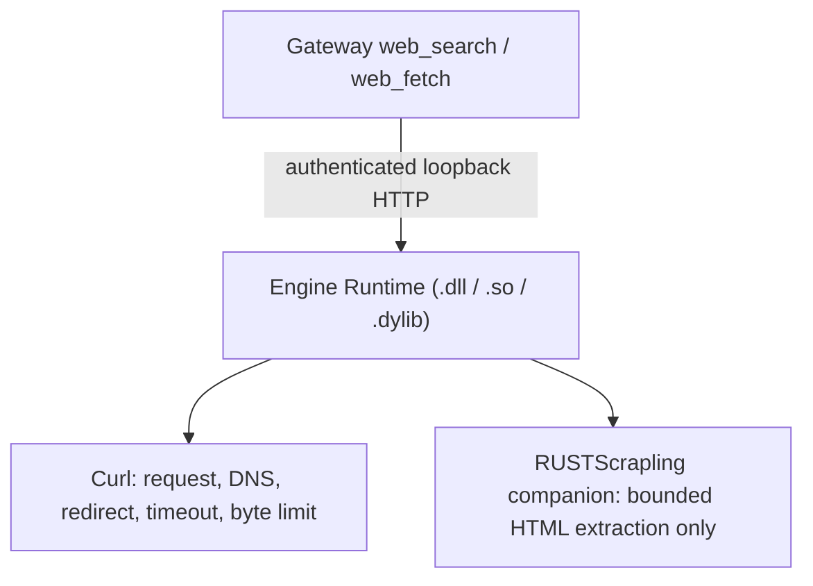

# 0009 - Structured search and Curl/RUSTScrapling page retrieval

* **Status**: Superseded in part by [ADR-0010](0010-duckduckgo-html-provider.md)
* **Date**: 2026-08-07
* **Decision makers**: Project lead

## Context

The original web-search implementation parsed public search-engine HTML and
then tried to recover relevance with local keyword scoring. Search engines can
return CAPTCHA, consent, locale, or generic portal pages instead of results, so
that design produced unrelated first-token matches and required browser state
that did not belong in a search provider.

Direct page reading still needs a single network policy for redirects, DNS,
private addresses, response limits, and timeouts. HTML extraction is a separate
concern and should be independently replaceable without adding a CGO boundary
to Gateway or folding another large dependency graph into the Engine Runtime.

## Decision

`web_search` uses only structured provider APIs:

- DuckDuckGo is the default and combines its HTML results with Instant Answer;
- SearXNG uses an explicitly configured endpoint with `format=json`;
- OpenSERP uses an explicitly configured endpoint and engine options.

Provider order is authoritative. Gateway validates result URLs, removes exact
duplicates, and applies the configured limit; it does not rescore results from
query keywords. DuckDuckGo HTML supplies the primary web-result list while
Instant Answer supplies separately typed featured answers or summaries.

There is no Bing or Google HTML provider, generic JSON mapping, HTML fallback,
CAPTCHA challenge, human-verification browser, visible-browser setting, or
silent provider downgrade.

Page retrieval is composed from two modules:

`POST /api/network/fetch` accepts bounded HTTP(S) GET requests from the
authenticated Gateway. Curl is the only network transport. RUSTScrapling never
opens sockets and receives only HTML already fetched through Curl. Gateway may
fall back locally for plain text, JSON, and XML, but an HTML response without
RUSTScrapling output is an error.

RUSTScrapling 0.2.2 is vendored from commit
`9be13ce8e0793b7ba4c0d0500c2314039e6f07b0` and wrapped by the
`encorehub-rust-scrapling` crate. It is packaged as
`encorehub_rust_scrapling.dll`, `libencorehub_rust_scrapling.so`, or
`libencorehub_rust_scrapling.dylib`, separate from
`encorehub_desktop_runtime`. Its versioned C ABI uses caller-owned output
buffers so Rust allocations never cross dynamic-library boundaries.

Curl remains dynamically linked by Engine Runtime and ships beside it with
the required native libraries. `engine-runtime.json` records both runtime
artifacts, the RUSTScrapling ABI, sizes, SHA-256 digests, target, profile, and
Curl dependencies. Desktop packaging fails when a module is absent or the
RUSTScrapling companion does not match the manifest.

The Curl service enforces these invariants:

- only absolute HTTP and HTTPS GET URLs are accepted;
- URL user information and literal local/private destinations are rejected;
- approved DNS results are pinned into Curl for each transfer;
- redirects are followed manually, re-resolved, and revalidated at every hop;
- provider headers are removed on a cross-origin redirect;
- public page reads cannot carry cookies, authentication, or custom headers;
- timeout, redirect count, header count, and decoded response bytes are bounded;
- errors and logs never include request headers or credential-bearing URLs;
- only explicitly configured SearXNG/OpenSERP endpoints may access private or
  localhost addresses; DuckDuckGo and public page reads always reject them.

Extracted content is marked as untrusted data before it reaches a model.
Scripts, styles, templates, vector/canvas content, navigation, forms, and page
chrome are excluded by the parser wrapper.

## Consequences

- Search result quality and ordering come from the selected API, not a brittle
  HTML layout or client-side guess.
- DuckDuckGo's no-key default can be rate-limited or challenged; users needing
  a controlled search service configure SearXNG or OpenSERP.
- Curl policy remains shared by search and direct page reading.
- RUSTScrapling can be rebuilt or upgraded independently from Desktop and the
  main Engine Runtime while ABI version 1 remains compatible.
- A configured private SearXNG/OpenSERP endpoint is a deliberate trust grant;
  arbitrary `web_fetch` URLs do not inherit that access.

## Alternatives rejected

- **Parse public search-engine HTML**: layout instability and CAPTCHA pages
  make successful HTTP responses semantically unreliable.
- **Open a browser for CAPTCHA**: introduces stateful human interaction into a
  structured provider and can launch UI without durable user intent.
- **Rescore results from query terms**: cannot repair an unrelated provider
  page and can incorrectly reorder authoritative API output.
- **Link RUSTScrapling into Engine Runtime**: enlarges the runtime upgrade unit
  and defeats the requested parser-module boundary.
- **Let RUSTScrapling fetch pages**: bypasses Curl's central SSRF and redirect
  policy and creates two network stacks.

## Related work

- [ADR-0004](0004-engine-in-process-and-internal-auth.md) defines Engine internal
  authentication.
- [ADR-0008](0008-versioned-desktop-runtime-modules.md) defines the independently
  upgradable dynamic Runtime modules.
